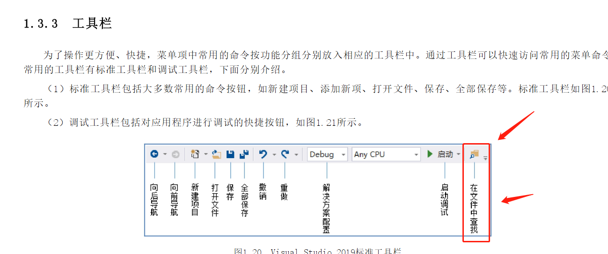

# 《C#从入门到精通》学习笔记

垃圾回收 是 .net 框架实现的，不是 C# 语言实现的。

> . NET Framework 是一 个 功能 非常 丰富 的 平台， 可 开发、 部署 和 执行 分布式 应用 程序

内容查找这个按钮在这里。

vs2019 快捷键。

> 在调 试 程序 或 运行 程序 的 过程中， 通常 可用 以下 4 种 快捷键 来 操作。 （1） 按 F5 快捷键 实现 调试 运行 程序。 （2） 按 Ctrl+ F5 快捷键 实现 不调 试运行 程序。 （3） 按 F11 快捷键 实现 逐 语句 调试 程序。 （4） 按 F10 快捷键 实现 逐 过程 调试 程序。
