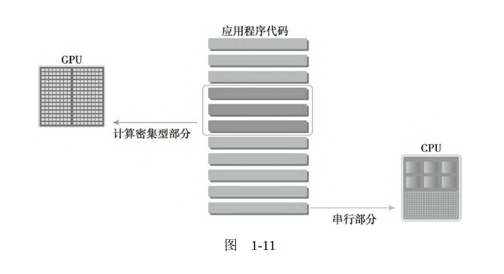

# 《CUDA-C权威指南》学习笔记

GPU 居然可以有 上万个线程

> 本章通过研究成千上万的线程是如何在GPU中调度的，来探讨硬件 层面的内核执行问题。解释了计算资源是如何在多粒度线程间分配的，

GPU 性能的线性扩展。

> 还说明了在GPU加速计算集群上的 大规模应用是如何利用MPI与GPUDirect RDMA来实现性能线性扩展 的。

现代处理器都是 哈弗结构。

> 大多数现代处理器都应用了哈佛体系结构（Harvard architecture），如图1-1所示，它主要由3个部分组成

块划分 跟 周期划分

> 数据并行程序设计的第一步是把数据依据线程进行划分，以使每个 线程处理一部分数据。通常来说，有两种方法可以对数据进行划分：块 划分（block partitioning）和周期划分（cyclic partitioning）。在

数据是一维空间。

> 通常，数据是在一维空间中存储的。即便是多维逻辑数据，仍然要 被映射到一维物理地址空间中。如何在线程中分配数据不仅与数据的物 理储存方式密切相关，并且与每个线程的执行次序也有很大关系。组织 线程的方式对程序的性能有很大的影响。

计算机架构。

> ·单指令单数据（SISD） ·单指令多数据（SIMD） ·多指令单数据（MISD） ·多指令多数据（MIMD）

> 在CPU上编写代码时，程序员可以继续按 串行逻辑思考但对并行数据操作实现并行加速，而其他细节则由编译器 来负责。

单指令多线程。

> GPU代表了一种众核架构，几乎包括了前文描述的所有并行结构： 多线程、MIMD（多指令多数据）、SIMD（单指令多数据），以及指 令级并行。NVIDIA公司称这种架构为SIMT（单指令多线程）。

GPU 与 CPU 的历史。

> GPU和CPU的来源并不相同。历史上，GPU是图形加速器。直到最 近，GPU才演化成一个强大的、多用途的、完全可编程的，以及任务和 数据并行的处理器，它非常适合解决大规模的并行计算问题。

GPU 是协处理器。

> GPU不是一个独立运行的平台而是CPU的协处理器。

GPU 是硬件加速器

> 当使用CPU上的一个与其物理上分 离开的硬件组件来提高应用中的计算密集部分的执行速度时，这个组件 就成为了一个硬件加速器。GPU可以说是最为常见的硬件加速器。

> 以下产品应用了NVIDIA公司的GPU计算平台。 ·Tegra ·GeForce ·Quadro ·Tesla

> CPU上的线程通常是重量级的实体。操作系统必须交替线程使用启 用或关闭CPU执行通道以提供多线程处理功能。上下文的切换缓慢且开 销大。 GPU上的线程是高度轻量级的。在一个典型的系统中会有成千上万 的线程排队等待工作。如果GPU必须等待一组线程执行结束，那么它只 要调用另一组线程执行其他任务即可。 CPU的核被设计用来尽可能减少一个或两个线程运行时间的延迟， 而GPU的核是用来处理大量并发的、轻量级的线程，以最大限度地提高 吞吐量。

CUDA 通过扩展语言来实现接口。

> CUDA平台可以通过CUDA加速库、编译器指令、应用编程接口以 及行业标准程序语言的扩展（包括C、C++、Fortran、Python，如图1-12 所示）来使用。本书重点介绍CUDA C的编程。

CUDA 的汇编语言是 PTX 。

GPU 可以控制数据的局部性。

> 例如，在CUDA编程模型中使用的共享内存（一个特殊的内存）。 共享内存可以视为一个被软件管理的高速缓存，通过为主内存节省带宽 来大幅度提高运行速度。有了共享内存，你可以直接控制代码的数据局 部性。

CUDA 的抽象讨论。

> CUDA抽象了硬件细节，且不需要将应用程序映射到传统图形API 上。CUDA核中有3个关键抽象：线程组的层次结构，内存的层次结构 以及障碍同步。这3个抽象是最小的一组语言扩展。随着CUDA版本的 更新，NVIDIA正在对并行编程进行不断简化。尽管一些人仍然认为 CUDA的概念比较低级，但如果稍稍提高抽象级，对你控制应用程序和 平台之间的互动关系来说会增加很大难度。如果那样的话，不管你掌握 了多少底层架构的知识，你的应用程序的性能都将超出控制。

指定 C 语言标准 C99。

> nvcc -Xcompiler -std=c99 sumArraysOnHost.c –o sum

cudaMalloc 函数分配内存。

> cudaMalloc与标准C语言中的malloc函数几乎 一样，只是此函数在GPU的内存里分配内存
>

CUDA 相当于可以直接控制 L2 缓存。

> 全局类似于CPU的系统内存，而共享内存类似于CPU的缓存。然而 GPU的共享内存可以由CUDA C的内核直接控制。

CUDA 帮助文档。

> 你可以在CUDA编译 器文件中找到编译器选项（http://docs.nvidia.com/cuda/cuda-compilerdriver-nvcc/index.html）。

CUDA 6.0 的统一寻址功能。

> 为了避免这类错误，CUDA 6.0提出了统一寻址，使用一个指针来 访问CPU和GPU的内存

这是啥意思？

> 在CUDA程序中有两组不同的网格和块变量：手动定义的dim3数据 类型和预定义的uint3数据类型。

块变换，相应的网格也会变化。

> 下面是一个输出示例。由于应用程序中的数据大小是固定的，因此 当块的大小发生改变时，相应的网格尺寸也会发生改变。
>
> 要确定块尺寸，通常需要考虑： ·内核的性能特性 ·GPU资源的限制

CUDA 的线程模型。

> CUDA的特点之一就是通过编程模型揭示了一个两层的线程层次结 构。由于一个内核启动的网格和块的维数会影响性能，这一结构为程序 员优化程序提供了一个额外的途径。 网格和块的维度存在几个限制因素，对于块大小的一个主要限制因 素就是可利用的计算资源，如寄存器，共享内存等。某些限制可以通过 查询GPU设备撤回。

CUDA 核函数的语法。<<<>>> 里面是网格跟块参数，不是正常的参数。

> kernel_name<<<1,10>>>(argument list)

> 同一个块中的线程之间可以相互协作，不同块内的线程不能协作。 对于一个给定的问题，可以使用不同的网格和块布局来组织你的线程。

CUDA 的线程布局。

