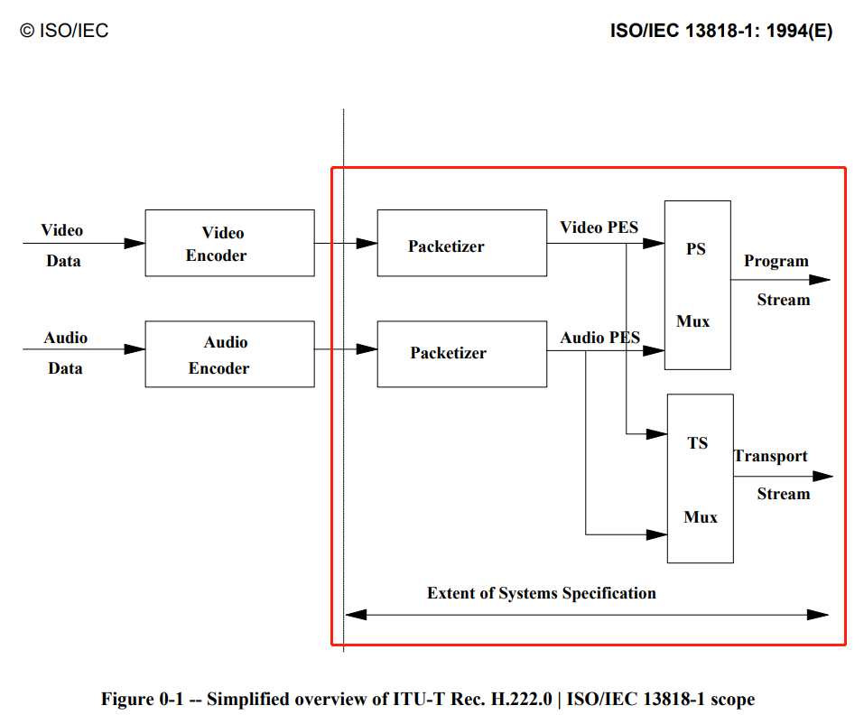
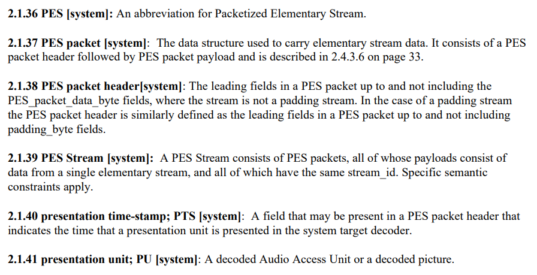
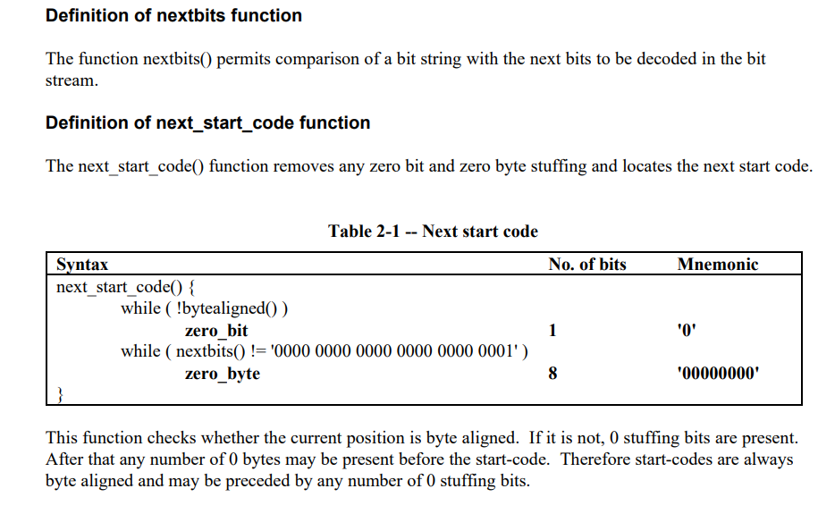
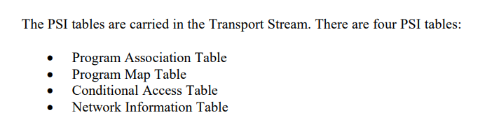

# 《ISO-IEC-13818-1》学习笔记

ISO-IEC-13818-1 标准文档的主要内容：

------

PS 跟 TS 的设计目标。

> Program and Transport Streams are designed for different applications and their definitions do not strictly follow a layered model. It is possible and reasonable to convert from one to the other; however, one is not a subset or superset of the other. In particular, extracting the contents of a program from a Transport Stream and creating a valid Program Stream is possible and is accomplished through the common interchange format of PES packets, but not all of the fields needed in a Program Stream are contained within the Transport Stream; some must be derived. The Transport Stream may be used to span a range of layers in a layered model, and is designed for efficiency and ease of implementation in high bandwidth applications.

------

H.262 标准文档 在 ITU-T Rec. H.262 | ISO/IEC 13818-2 跟 ISO/IEC 13818-3

> The basic multiplexing approach for single video and audio elementary streams is illustrated in figure 0-1 on page xi . The video and audio data is encoded as described in ITU-T Rec. H.262 | ISO/IEC 13818-2 and ISO/IEC 13818-3. 

实现有很大的灵活性。

> The systems specification does not specify the architecture or implementation of encoders or decoders, nor those of multiplexors or demultiplexors. However, bit stream properties do impose functional and performance requirements on encoders, decoders, multiplexors and demultiplexors. For instance, encoders must meet minimum clock tolerance requirements. Notwithstanding this and other requirements, a considerable degree of freedom exists in the design and implementation of encoders, decoders, multiplexors, and demultiplexors.

TS 封装有两个优势，抗传输误码 跟 包丢失。

> The Transport Stream is a stream definition which is tailored for communicating or storing one or more programs of coded data according to ITU-T Rec. H.262 | ISO/IEC 13818-2 and ISO/IEC 13818-3 and other data in environments in which significant errors may occur. Such errors may be manifested as bit value errors or loss of packets.

文档经常提到 overflow 是啥意思？

> Multiplex-wide operations include the coordination of data retrieval off the channel, the adjustment of clocks, and the management of buffers. The tasks are intimately related. If the rate of data delivery off the channel is controllable, then data delivery may be adjusted so that decoder buffers neither overflow nor underflow; but if the data rate is not controllable, then elementary stream decoders must slave their timing to the data received from the channel to avoid overflow or underflow.

第一个包有分辨率之类的信息。

> An additional multiplex-wide operation is a decoder's ability to establish what resources are required to decode a Transport Stream or Program Stream. The first pack of each Program Stream conveys parameters to assist decoders in this task. Included, for example, are the stream's maximum data rate and the highest number of simultaneous video channels. The Transport Stream likewise contains globally useful information.

PES 也不是完全独立于 编码层。

> The PES packet layer is independent of the compression layer in some senses, but not in all. It is independent in the sense that PES packet payloads need not start at compression layer start codes, as defined in parts 2 and 3 of this Recommendation | International Standard. For example, video start codes may occur anywhere within the payload of a PES packet, and start codes may be split by a PES packet header. However, time stamps encoded in PES packet headers apply to presentation times of compression layer constructs (namely, presentation units). In addition, when the elementary stream data conforms to ITU-T Rec. H.262 | ISO/IEC 13818-2 or ISO/IEC 13818-3, the PES_packet_data_bytes shall be byte aligned to the bytes of ITU-T Rec. H.222.0 | ISO/IEC 13818-1.

系统层的作用。

> The system layer supports five basic functions: 1) the synchronization of multiple compressed streams on decoding, 2) the interleaving of multiple compressed streams into a single stream, 3) the initialization of buffering for decoding start up, 4) continuous buffer management, and 5) time identification

反离散余弦变换 算法原来也有标准文档规范的。

> IEEE Standard 1180-1990 Standard Specification for the Implementations of 8 by 8 Inverse Discrete Cosine Transform.

熵编码，可变长度。

> entropy coding: Variable length lossless coding of the digital representation of a signal to reduce redundancy.

这个文档有一大堆术语，可以参考。

解码器语法。

> The bit streams retrieved by the decoder are described in 2.4.1 on page 10 and 2.5.1 on page 53. Each data item in the bit stream is in bold type. It is described by its name, its length in bits, and a mnemonic for its type and order of transmission.

定义了很多函数语法。

 PSI tables 集合：

