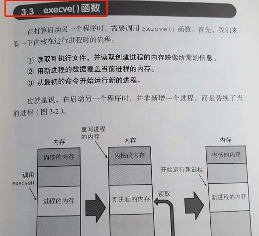

# 《Linux是怎么工作的》学习笔记

如果没有 Linux 这样的 OS，就不得不为每个进程单独编写调用设备的代码。

什么是内核。

并不存在用户进程绕过系统调用而直接切换 CPU 运行模式的方法。

查看系统调用所消耗的时间。

系统调用的汇编代码。

fork 跟 execve 的系统调用。

注意这个起始地址。

新知识，execve() 函数不会创建新的进程，而是把可执行文件的指令 插入当前进程来执行。 

所以 execve() 就跟当前进程调用一个内部的函数类似的。

taskset 可以绑定程序在某个 CPU 上做测试。

上下文切换导致吞吐量降低。

ps -eo 可以查看进程的运行时间跟 执行时间。

nice -n 设置进程的优先级。

内核的 OOM killer 功能。

虚拟内存可以说是 CPU 提供的功能。

这里是指 CPU 有特殊的集成指令来进行 地址转换。

SIGSEGV 信号是 缺页中断机构 检测到非法访问抛出来的。

malloc 里面回调 mmap 函数。

glibc 居然有内存池功能。

系统调用不一定会导致进程切换，而是让当前进程进入内核模式，能访问到之前访问不到的内核的内存区域。

内核的内存区域会被映射到所有进程的虚拟地址空间，注意，是所有的进程都会映射。但是这块内存区域会标记为 "内核模式专用"。

在用户模式下访问不到内核的内存区域，虽然已经内核的内存已经映射给了所有进程。

mmap 的映射流程。mmap 不一定会立即分配物理内存。只是映射一下。

分页机制，决定 虚拟内存是不是物理内存。

sar -B 跟 ps -eo 可以观察进程的缺页中断情况。

虚拟内存不足与 物理内存不足。

写时复制，居然是用权限来控制的。

Swap 会导致系统抖动。

查看交换的情况。

硬性页缺失 与 软性页缺失。

mmap 的 MAP_HUGETLB 获取标准大页的情况。

高速缓存可以在 CPU 内，也可以在 CPU 外面。

性能优化技巧，减少单位时间的内存访问访问。

TLB 的作用，注意一下。

页面缓存机制，针对硬盘的。

超线程确实是有 多份 寄存器的。

文件系统的处理过程。

不一致是文件系统导致的，如果直接读写驱动设备，应该可以避免这个问题，mysql 等数据库可能用到这些奇淫技巧。

注意一下 ioctl 这个函数。

Linux 本身就有的内存文件系统。tmpfs

可以直接看进程的命令行参数。

Linux 的 cgroupfs，限制进程使用的资源。CPU 跟 内存。

通用块层。

注意一下 I/O 调度器。

