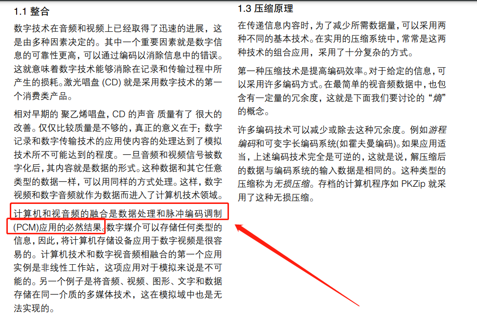
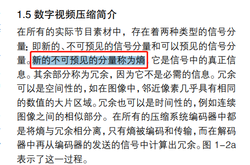
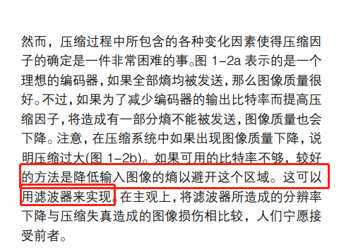
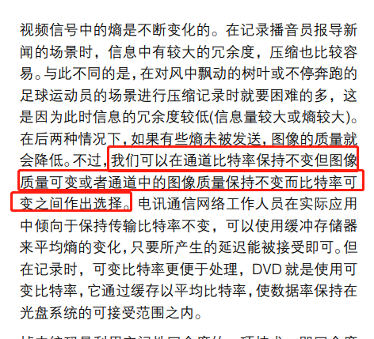
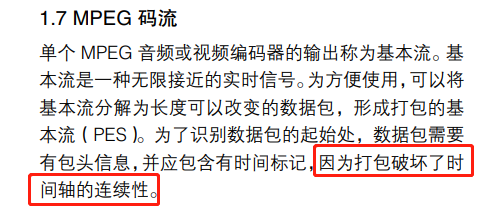

# 《MPEG基础和协议分析指南》学习笔记-1

> 计算机和视音频的融合是数据处理和脉冲编码调制 (PCM)应用的必然结果。



------

> 在所有的实际节目素材中，存在着两种类型的信号分 量：即新的、不可预见的信号分量和可以预见的信号分 量。新的不可预见的分量称为熵，它是信号中的真正信 息。



------

滤波器 的作用，把一部分熵删掉，降低传输数据量。



------

> 不过，我们可以在通道比特率保持不变但图像 质量可变或者通道中的图像质量保持不变而比特率可 变之间作出选择。

比特率 不变 就是码率不变，但是图像质量会下降。图像质量不变所以码率必须变。



------

> 电讯通信网络工作人员在实际应用 中倾向于保持传输比特率不变，可以使用缓冲存储器 来平均熵的变化，只要所产生的延迟能被接受即可。

这里，传输比特率不变，但是熵变大了，数据变大了，他们用延迟buffer 来对抗数据变大的方法。

------

> 因为打包破坏了时 间轴的连续性



------

加密节目。

> 某些节目是开放式的，但是有一些节目是 用于条件接收(加密)的，这些信息也包含在元数据中

时间域编码 就是 帧 间编码。

> 时间域编码除了会增加编码和解码的延迟之外，它还 给图像的编辑造成了困难。事实上，MPEG 数据流是 不能够任意编辑的。所以有这种限制，是因为在时间域 编码中，对某一画面的解码可能需要早先的画面内容， 而这早先的画面内容在编辑完成后可能就没法获得了。 还有，在 MPEG 中，不一定是按照实际图像出现的先 后顺序来发送图像，这将使编辑更为复杂。


变换，就是信息的另一种表示方法。

> 所谓变换，简而言之，就是波形在不同域中的表 示方法


MPEG-2 视频编码 与 H262 是同一个，只是以不同的名称授权。

> 图 4-3 表明了视频标准的演变。可以看到有时 ITU-T VCEG 组和MPEG WG 11组会合作推出新的视频编码 标准。那么编解码器就会被两个组织以不同的名称授 权。比如合作的 MPEG-2 视频编码标准在 ITU-T 组织 中就称为 H.262。


H.264/AVC 兼容 MPEG-2 的标准。

> 流进行很小的修改，就能够像传输 MPEG-2 视频一样 传输 H.264/AVC 视频。这样，H.264/AVC 对于一直使 用 MPEG-2 传输流(TS)整个的广播业就有了很大的吸 引力。包含有H.264/AVC视频的MPEG-2码流可以后 向兼容现有的、昂贵的基础设施—卫星传输，TV/ 有线 传输等等。只需要更新前端和终端的视频处理设备，就 可以享受到H.264/AVC提供的可达到高清画质的视频。


很多公司意识 到了这个标准的成熟性，对其进行商用，从而推动了这 个标准的发展，说明公司内部本来有自己的编解码器。

> 尽管H.264/AVC也很复杂(参阅 H.264/AVC的复杂性)， 但是这个标准的设计和描述都很出色。相对来说，和标 准查验软件互相也很配合。这样，虽然工程师在进行H. 264/AVC 编码的过程中，有大量的工作要做，但是比 起 MPEG-4 第二部分要容易实现的多。很多公司意识 到了这个标准的成熟性，对其进行商用，从而推动了这 个标准的发展。


没有定义编码器的工作方式

> 在结束 MPEG-1 的讨论之前，需要注意的是要看标准 中所包含的实际内容以及它是如何实现互操作性的。 MPEG-1 标准定义了一整套工具，比特流的句法以及 解码器的工作方式。但它并没有定义编码器的工作方 式－只要是能够提供有效句法比特流的任何设备，都 是有效的 MPEG 编码器。还有，该标准既没有定义图 像质量，也没有定义编码质量，从而允许开发各种编码 技术而无需改变现有的标准，也不会造成现有解码器 的废弃。这种模式沿用在整个 MPEG 标准中。这种模 式的采用，所带来的成功是明显的：尽管 MPEG-2 是 应用于视频的，但在今天的 DVB 传输系统应用中，仍 然将 MPEG-1 中层 2 音频作为主要的音频压缩系统。


MPEG-2 干掉了 MPEG-3 

> MPEG-2 在许多方面都代表着 MPEG 时代的到来。将 MPEG 的巨大灵活性与大规模集成电路日益增长的可 用性相结合，这就意味着 MPEG-2 具有非常广泛的应 用。MPEG-3 的终结是 MPEG-2 成功的一个精彩印 证。MPEG-3本来是用于高清晰度电视的，它的夭折， 是因为MPEG-2能够很容易地将其应用调整到高清这 一领域，这


MPEG-4 优势，每个对象可以独立编码。

> 各自独立 的对象编码具有很多优点。每个对象的编码都可以用 自己最适合的方式来进行，也可以按其需要使用不同 的空间分级或者时间域分级编码(


> MPEG-4 第 15 部分规定了在 MP4 文件中携带 H.264/ AVC 基本流的数据格式。


MPEG 对编码器未作定义，但 它必须能够提供句法正确的码流。

> 基本流是由编码器输出的原始基础码流，它只含有解 码器所必需的、并与原始图像或原始音频相接近的信 息。MPEG对已压缩信号的句法作了严格的定义，以保 证解码器能够正常解码。MPEG 对编码器未作定义，但 它必须能够提供句法正确的码流。


标准化 降低 解码器的生产成本。解码器远多于编码器。

> MPEG 这样规定 的优点是它与 实际情况相符 合。在 世界上，解码器的数量要远多于编码器，对解码器标准 化后，可以降低它的生产成本。与之相反，编码器则可 以更复杂和更昂贵，对成本的考虑也可以放宽。当然， 随着编码器的日益复杂，所提供的图像质量也会更高。 当编码器和解码器的复杂度存在差别时，这种编码系 统可称为非对称系统。


> MPEG 对编码器不作定义，这就有可能通过改进编码 算法来提高图像质量，而且产生的码流也能被早期的 解码器所接收。还有，因为未对编码器作定义，也就是 在非公共范围内允许使用专用的编码算法。


> 为了满足不同的需求，对节目流和传输流的设计在上 述方法中各择其一。即在记录环境中，通常是一个节 目，则采用可变比特率；在传输环境中，通常是多个节 目共用一通道，则使用固定比特率传送。


> PSI由具有唯一 PID的数据包所传送。其中有些 PSI是 标准的，有些 PSI 由节目关联表(PAT)、条件接收表 (CAT)和传输流描述表(TSDT)所规定。这些数据包应当 周期性地放置在每个传输流中。PAT 的 PID 总为 0， CAT 的 PID 总为 1，而 TSDT 的 PID 总为 2


WebRTC 的 前向纠错技术 很早就有了。

> Turbo 8PSK 使用了高级 Turbo编码前向纠错技术，在 不增加天线面积和载波功率的情况下，提高了8PSK调 制卫星链路的数据交换传输能力。Turbo编码前向纠错 把统计学原理运用于数据恢复概率，在第十章会有具 体的介绍。

> 在广播中，几乎无法对信号质量和噪声或干扰进行控 制。这就需要某种形式的前向纠错(FEC)层。与长途电 信网络运营商所使用的 FEC 不同，后者是具有专利的 (或按欧洲电信标准学会(ETSI)标准化，ETSI对SDH 和 PDH 网络的 DVB 传输作了规定)，广播中使用的 FEC 必须标准化，从而使接收机能够对它进行处理。

> 由于长距离传输中有很多因素是无法控制的，因此必 须进行误码校正。在某些系统中，误码校正是很充分 的，因为在出现误码时可以请求重新发送。显然，这个 办法对于实时信号如电视是行不通的。另一个办法是 使用前向误码校正(FEC)，它是将足够的额外比特(即所 谓冗余)添加在数据上，以便解码器进行实时校正。

> 现代系统中使用的 FEC 通常是基于里德－所罗门(RS)编码。简而言之，R-S编码是在一段数据字节中添加 奇偶校验字(如N个字节)来增加冗余，使得接收机内的 R-S解码器可以恢复在一组字节中的每个(或N/2)字节 中的任何(或所有)比特。


0x47 不参与 编码以及传输。

> ATSC 标准中，0x47 同步字节从不编 码和传输，而用一个特定的、2电平同步脉冲代替该字 节进行传输，接收机在此位置上插入 0x47 同步字节。


注意 DVB-H 标准。

> 当然MPE 几乎支持任何类型的网络协 议，不仅仅局限于 TCP/IP 数据。DVB-H标准使用MPE 向手机传输视音频基本流。DVB-H通常使用UDP/IP替 代TCP/IP来传播数据。很多应用也通过实时协议(RTP) 使视音频同步(唇音同步)变得简单。图 11-1 说明了 DVB-H 协议的架构。


过编码以消除信息中的错误 是什么意思？

```
数字技术在音频和视频上已经取得了迅速的进展，这
是由多种因素决定的。其中一个重要因素就是数字信
息的可靠性更高，可以通过编码以消除信息中的错误。
这就意味着数字技术能够消除在记录和传输过程中所
产生的损耗。激光唱盘 (CD) 就是采用数字技术的第一
个消费类产品。
```


