# SEO实战密码 学习笔记

没有流量的排名是没有意义的。即便给你排到第一，但是别人根本不搜这个关键词，排第一又有什么意义呢。

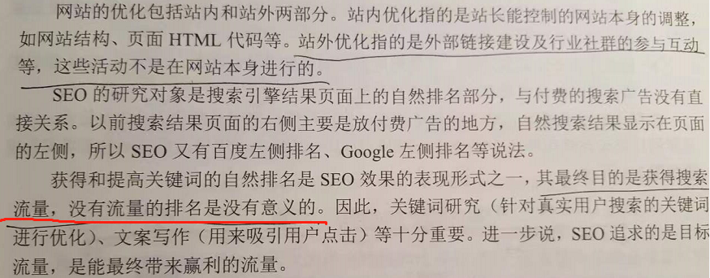

搜索流量质量高。

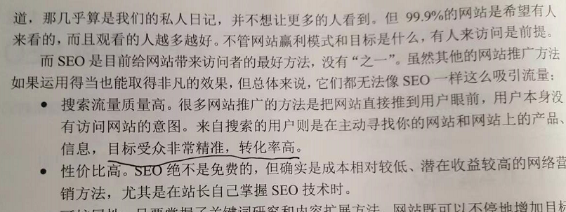

搜索对线下销售的影响。

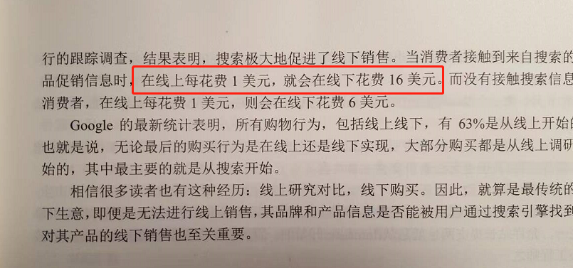

搜索的演变。

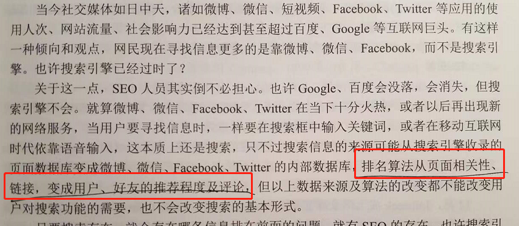

GoTO 发明的竞价排名。

百度的绿菠萝算法。

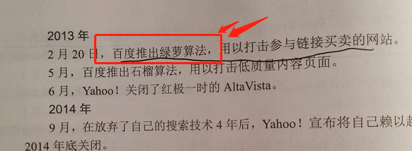

搜索引擎的智能性。

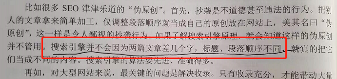

根据搜索结果查看竞争情况。

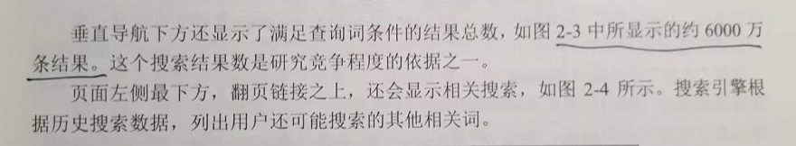

注意 Description Tag。如下：

2.3.10 有讲 Google 的精选摘要。

深度优选与广度优选策略。

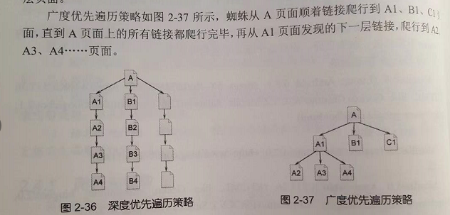

第 37 页，搜索引擎会去重。

第 42 页的相关性计算。

可以搜索特定的文件类型，例如我们要找 PDF 书籍，可以用这个过滤。

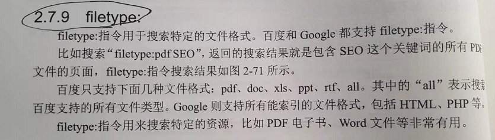

流量不一定是资产，转换才是

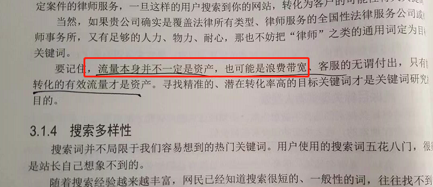

google 关键词工具。，"关键词规划师"

5118 营销大数据。

应该能根据 nginx 的日志 refer 查看到哪些搜索关键词引用到我们项目。

检索别人有没抄袭。

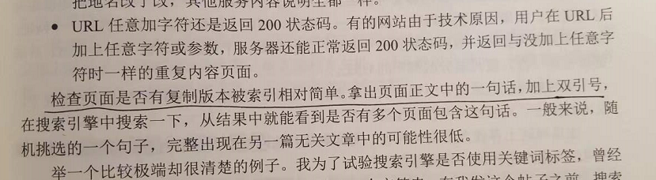

这个法子好，优化描述，吸引别人点击。

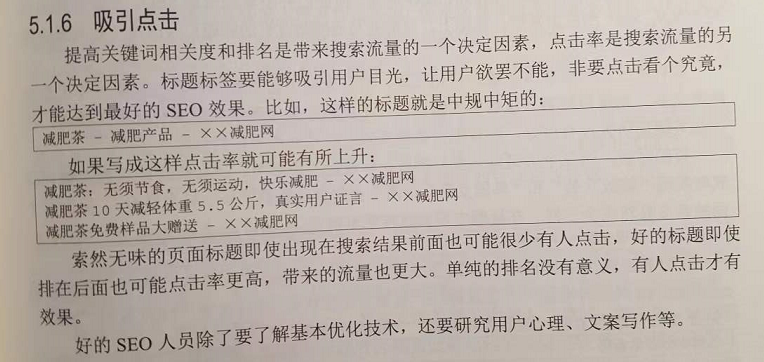

不用浪费时间写关键词标签。

273页的关键词的平均排名，先优化排名高的关键词

快排作弊。百度电击器。

注意看他的精选摘要优化。

SEO 的盈利模式，第 358 页。

第12 章有很多 SEO 相关的工具。

google 趋势要关注、

注意，可以查看网站访问量的工具特别好，google 以前有一个。

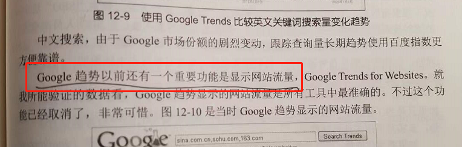

Google Alert 工具不错。

