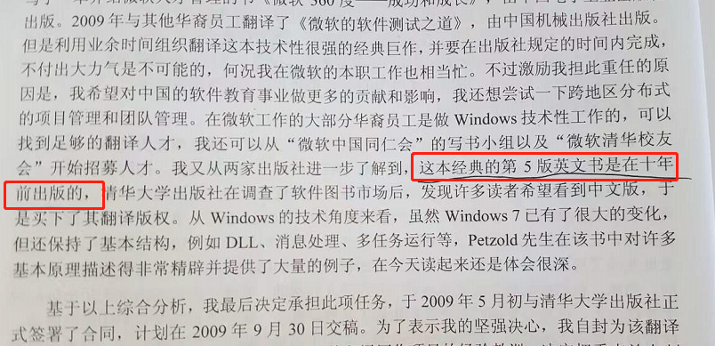

# 《Windows程序设计第五版》学习笔记

图形显示接口就是 GDI，实际上就是显卡的接口，或者说是 显示器的接口。

这本中译本是 10 年后才出的。

翻译的技巧。

注意计时器。

注意，视频显示器也是用户输入的一部分。

早期是非抢占型的。

Windows 本身就是一套动态链接程序库。

动态链接是 Windows 先搞出来的东西。

3个关键的动态链接库。

大部分的编程语言都是在 API 上加一层编程语言。

C语言的发明者，同时研发了 unix 操作系统。

sz 意思是 String Terminated with a zero。

Prev 参数没有用了。

`VCVARS32.BAT` 脚本就是用来设置环境变量的。

Windows 环境是 NMAKE。

内存范围。

L 的作用。

 UTF8 是变长编码

Windows 不存在标准输入 和 标准输出的概念。

注意消息队列。

注意，匈牙利标记法，前面的类型。

`lpfn` 的含义，"指向函数的长指针"。

这几个东西是有规律的。

`SendMessage` 可以主动发消息。

注意多线程的情况。

以前的操作系统不是抢占式的。

我靠，Windows 遮住了需要重新绘制的。

GDI 不是完全硬件隔离的。

多线程的概念。

Windows 里传输数据的方式，剪切板，DDE 等等。

Windows 的鼠标胖的沙漏图标，这是经典。

1/10 秒规则。

原来 16 位会加两次，他说的是一个写，一个读，而不是两个写。

注意这个 _beginthread 函数。

`/MT` 标记。

Sleep 可以传 0 ，让操作系统重新调度需要的线程。

Windows 系统的进程间互斥。

Windows 的 TLS，线程本地存储功能。

静态库就是对象库，而导入库是用来包含重定位表格啥的。

注意 DLL 的入门，DLLMain。

DLL 里面的共享内存。

动态链接库中的任何一个能够被其他 Windows 程序或动态库引用的函数必须被导出。

---

音频处理概念。

注意这两个网络套件，WinSock 与 WinInet

