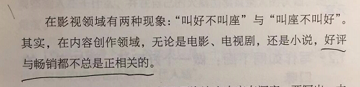
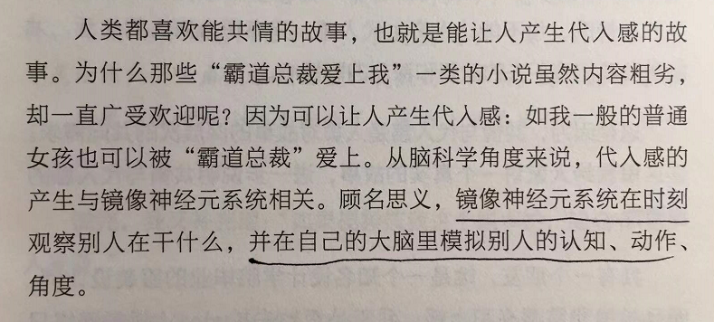
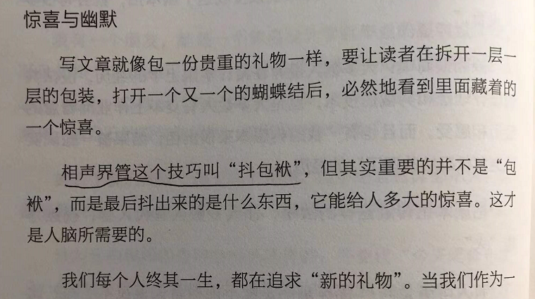
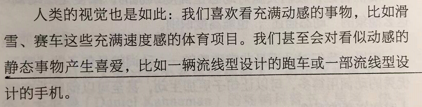
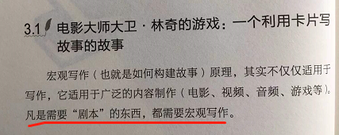
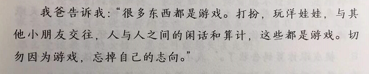

# 《写作脑科学》学习笔记

脑电图是跟着血液里铁的移动来绘图的。

好评与畅销不总是正相关的。

镜像神经元的作用。

惊喜，抖包袱。

惊喜越来越少。

流线感。

飞速成稿。

近义词替换游戏。

剧本需要宏观写作。

勿玩物丧志。

绝大多数人都不爱动脑子。

根据可读性来分级。

中文可读性计算系统 CRIE。

一次性补贴的好处。

所有流程复杂的地方，都有深度赚钱的机会。

安全感，细节，相信。

因果只是把高维模型简化了。

正反论证与矛盾统一。

