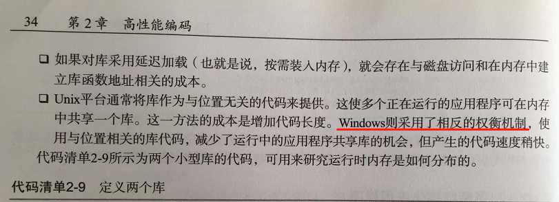

# 《多核应用编程实战》学习笔记

面积换核心。

硬件线程与软件线程。

分支会影响预测，看看有什么优化方法。

CPU 内部是用广播的方式来实现缓存一致性。

两种内存架构。
1，UMA（统一内存架构）
2，ccNUMA（缓存一致的非统一内存架构）

函数调用约定，是ABI 用的一部分。

历史的 64 位技术。64位会用寄存器传参。

锁原理，实际上就是一个变量好像。因为赋值只需要一条指令，所以一条指令就是原子性的。

锁的原理就是用单条指令封装多条指令成 原子操作。操作是单条，还是多条，是从不同的角度来看的。

进程的数据布局。

多进程架构的缺点，增加 TLB跟缓存的未命中率。

注意内存排序指令。

并行编程的关注点，缓存，以及是否能扩展多个处理器。

编译器处理静态库的时候无法利用内联优化

Windows 不是用的位置无关的动态库方式，

延迟加载什么时候会失效。

如何提升数据读取性能。

a 跟 b 指向不同的内存。

优化技巧，让编译器能看到更多的代码。

移位 比 乘除更快。

编译优化还有一个 fast 宏。

跨文件优化，可能需要把两个文件 一起编译，也就是需要 gcc 同时编译两个文件，不能独立编译。

内联太多会导致程序代码太大，指令缓存命中率下降。
因此通常只内联有利于性能提示的函数，避免内联只会增加指令缓存需求量的函数。

第一次知道，原来可以配置反馈文件来收集程序的运行时信息。
然后把运行时信息再输出给编译器来优化性能。

解决别名的方法。

尽量不要手写汇编，应该适当使用编译器的标记。

容器技术，Solaris 的 Zone，FreeBSD 的 Jail。

两种虚拟化的技术方案。

流水线式的并行方法。

检查热点代码，可以用运行时配置文件。

Helgrind 可以检测数据争用。

注意 屏障函数。

无锁是通过更低级别的原子操作 CAS 实现的。C++ 的 automatic 应该就是通过 CAS 实现的。反汇编看一下。

 

__thread 关键字。

控制大多数线程到某个位置再一起往下跑。

注意 OpenMP。

编译器可以实现一定程度的并行化。

OpenMP 也可以用互斥锁。

弱内存排序。

操作系统提供了原子操作。

ABA 问题可以用版本号来解决。

快排的多线程实现。

内存优化。

