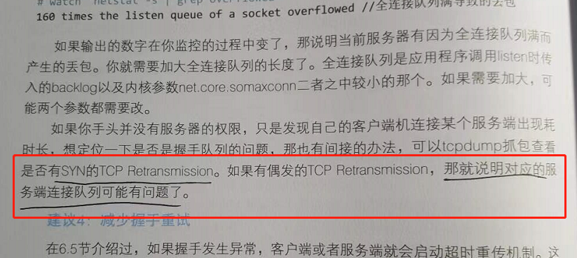

# 《深入理解Linux网络》学习笔记

Java 的 NIO 跟 Golang 的 net 包 只是对 epoll 的包装。

这种 ... 的伪代码风格不错，学习。

查看 RingBuffer 满没满。 overruns。

 RingBuffer 满 是丢弃后面的，不是丢弃前面的。

查看 CPU 执行了多少次软中断。

sendfile 函数的零拷贝。

用 哈希表管理半链接状态，udp 实现的 也可以参考这种做法。

半链接队列长度。

内核的保留端口参数。

端口不足导致 connect 自旋锁不断执行。

file-max 不限制 root 用户。

客户端还是阻塞性的。可以考虑用协程。

SYN 的 TCP 重传，可能是服务器的连接队列有问题。

关注公众号，获取配套源码这个法子不错。

注意 Docker 的Brige 。

