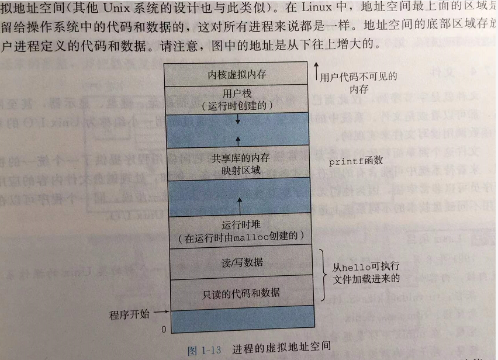

# 《深入理解计算机系统》学习笔记-计算机漫游

硬件描述语言 HOL，

乱序处理应该就是 指令级并行。

GCC 编译过，cpp是预处理器，cc1 是编译器，as 是汇编器，ld 是链接器。这4个命令在 Linux 里面都有。

进程的虚拟地址空间：

CPU 硬件多个备份。

超标量处理器，super-scalar。

GCC 向量数据类型。这里应该指的是 C++ ，而不是 C 语言的数据类型。

指令集架构是对硬件的抽象。

------

由于笔者的水平有限， 加之编写的同时还要参与开发工作，文中难免会出现一些错误或者不准确的地方，恳请读者批评指正。如果读者有任何宝贵意见，可以加我微信 Loken1。QQ：2338195090。
