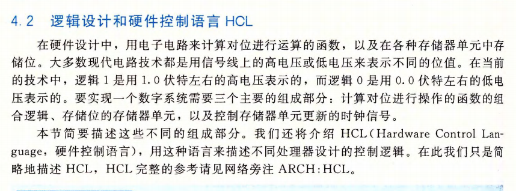

# 《深入理解计算机系统》学习笔记-第3、4章

CPU 的迭代历史：

------

CPU 并发地执行很多指令。

------

高级指令很难被编译器产生。

------

RISC 与 CISC 之争，挂羊头卖狗肉，混合实现。

------

硬件控制语言HCL，这本书还讲了硬件设置。

第四章讲了很多指令内部的逻辑，取指，驿马，执行，访问内存等等。可以仔细看看。

SEQ 硬件结构

什么是流水线：

CPU 指令预测技术。

------

由于笔者的水平有限， 加之编写的同时还要参与开发工作，文中难免会出现一些错误或者不准确的地方，恳请读者批评指正。如果读者有任何宝贵意见，可以加我微信 Loken1。QQ：2338195090。
