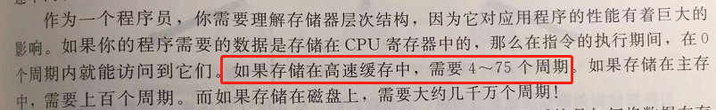
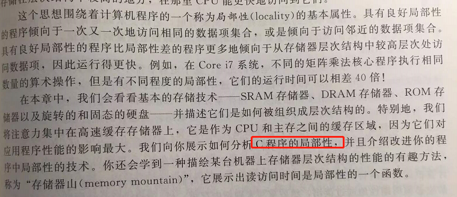
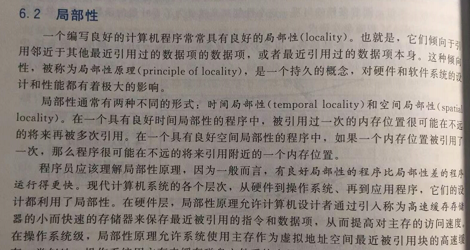
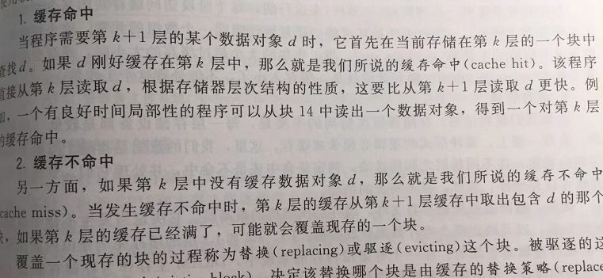
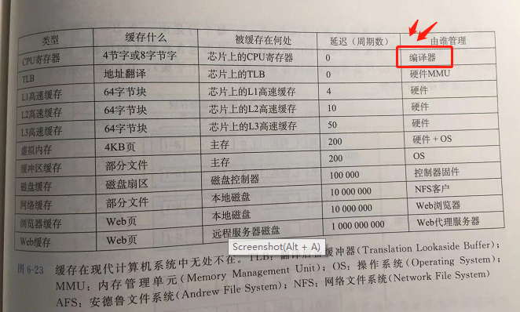
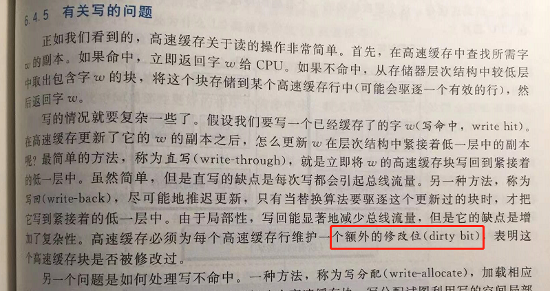
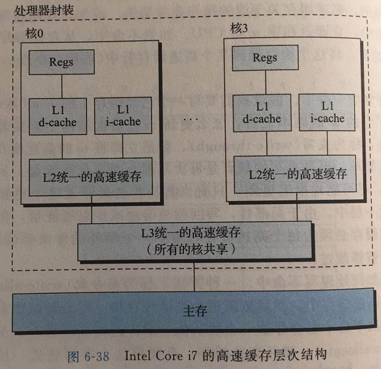
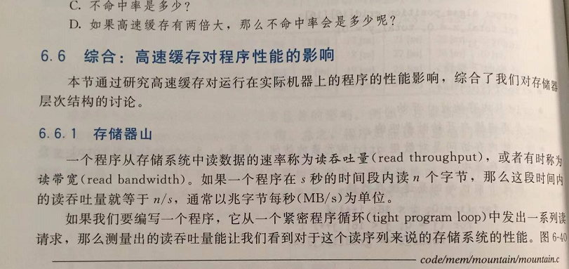

# 《深入理解计算机系统》学习笔记-存储器层次结构

各种层次的存储器访问周期：

C程序局部性优化：

缓存命中：

寄存器缓存是用 编译器来管理的

额外的位，表明高速缓存修改过。

寄存器实际上是一个超高速内存缓存，把数据放在寄存器里面。

高速缓存对程序性能的影响：

------

由于笔者的水平有限， 加之编写的同时还要参与开发工作，文中难免会出现一些错误或者不准确的地方，恳请读者批评指正。如果读者有任何宝贵意见，可以加我微信 Loken1。QQ：2338195090。
