# 《深入理解计算机系统》学习笔记-链接

这章有讲 ELF-64 文件格式。

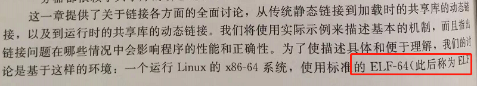

GCC 编译过程。

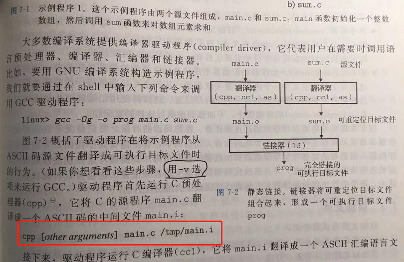

文件格式全称。

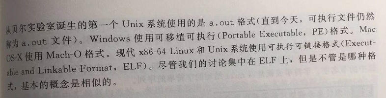

static 的妙用。

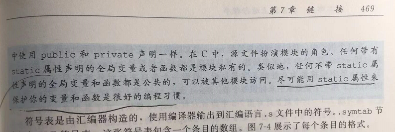

C 标准库。

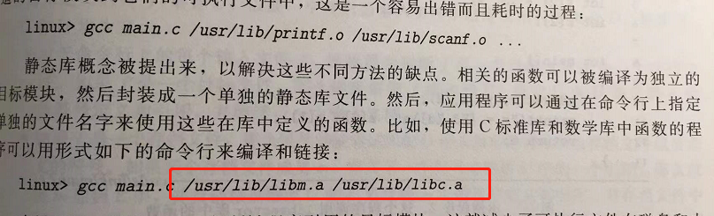

rel.txt 可重定位条码。

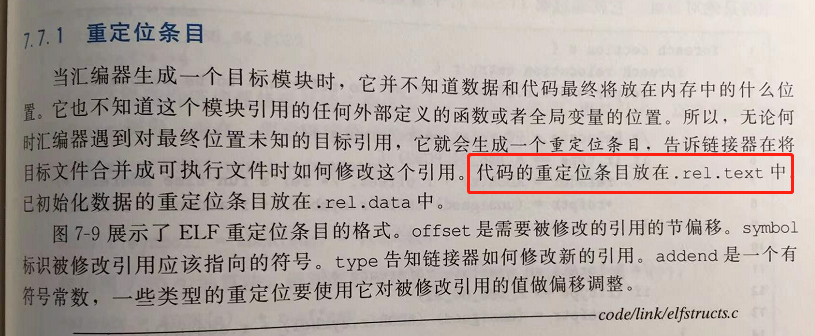

代码运行过程。

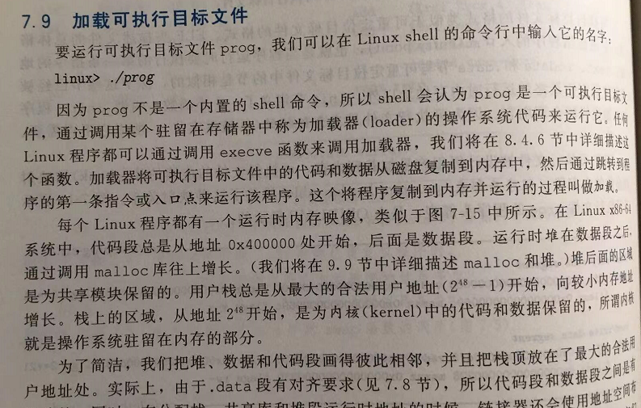

基础库弄成共享的，节省磁盘空间，因为很多程序都会用到基础库。

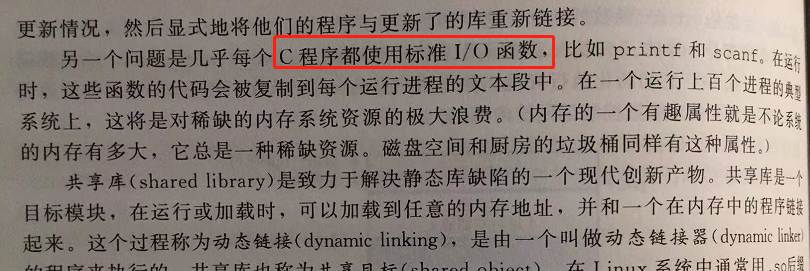

linux dlopen 引入共享库。

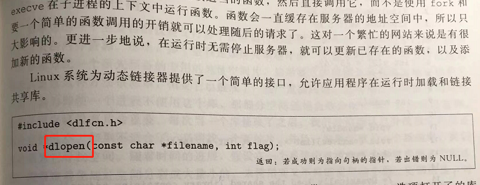

库打桩机制 嵌入自己的代码：

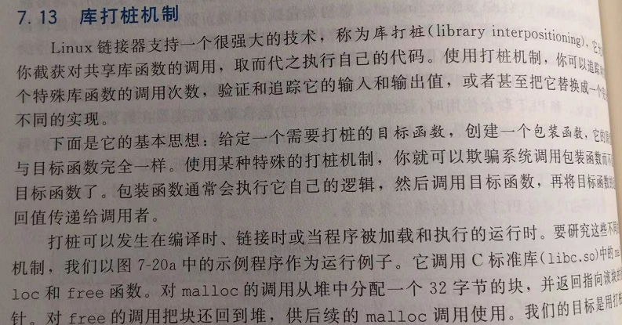

Linux 常用的二进制分析工具，特别是这个 STRINGS 命令。

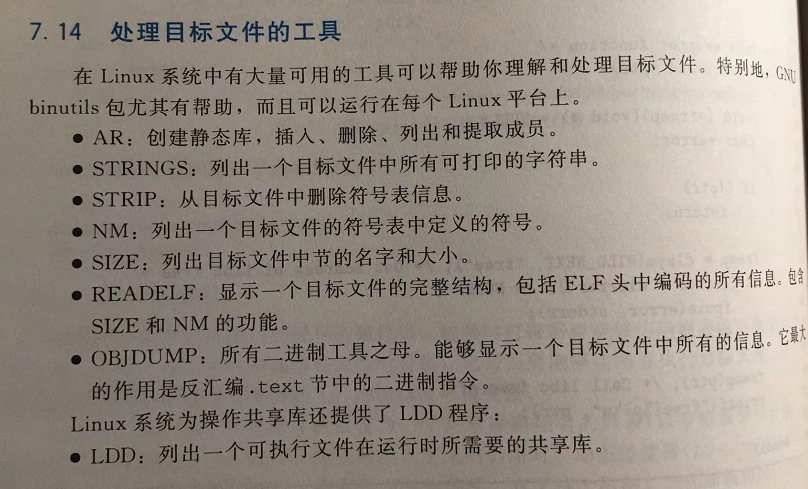

