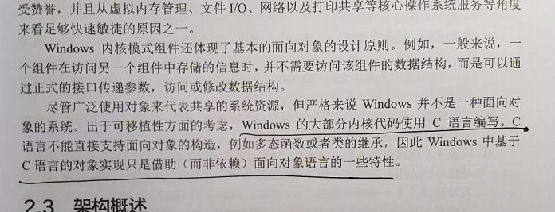

# 深入解析Windows操作系统卷一学习笔记

WDK 与 SDK 的区别。

Windows 的版本迭代。

获取Windows 版本号 的方法。

注意看 COM 技术。

WinJS 使用 Windows api。

.Net Framework 默认。

界面可相应：

对象与句柄。

Windows 的字符集。

Windows 工具大全。

Windows 的大部分内核代码都是 C语言写的。

Windows 的对称多处理器系统。

异构CPU。

注意一下 SUA 子系统。

Pico 进程是 WSl 的基础。

WinDbg 断点停下的地方。

注意 syscall 指令。

打开默认文件是通过 Windows Shell 实现的。

Process Explorer 查看进程的颜色。

时间片原来叫 量程 quantum。

调度器的实现是分散的。

可以修改  CPU 密集型进程的优先级，使其不至于影响到常规系统的操作。

Windows 的实时优先级的意义。

CMD 指定优先级启动程序。

注意 CPU Stress 工具。

CPU 饥饿导致的优先级反转。

内存飞地保护。

IO 系统实际上就是把各种设备的二进制数据读进去内存，例如 硬盘数据，麦克风数据，摄像头的视频数据，还有鼠标键盘的输入数据，这些都是二进制数据。

这些都是数字设备。只不过做了分层设计，分层能让整个系统更通用。所以电脑叫通用计算机系统。

分层，通用是有代价的，会牺牲性能，这也就是SOC芯片为什么功能不错，又便宜，因为从某种角度来看，SOC芯片牺牲了通用性。

但是分层的好处也是显而易见的，可以产生更丰富的生态。给一堆积木，上层可以搭建各种东西。

注意 IO 系统。

注意快速 IO。

Windows 本身就有比 Linux epoll 更优的 IO 操作方式。

Windows 有 IO 优先级。

驱动验证程序可以测试驱动。
