# 《现代操作系统》学习笔记-引论

Windows 8 的纤程。

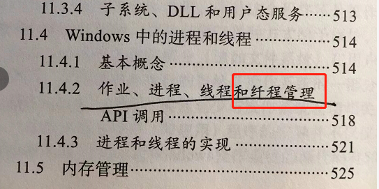

------

TODO，搞清楚具体是哪个指令在用户态是禁止的。

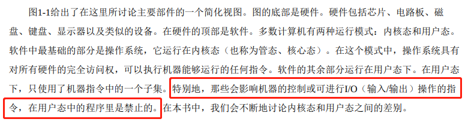

------

嵌入式系统没有内核态。

> 然而，有时在嵌入式系统（该系统没有内核态）或解释系统（如基于Java的操作系统，它采用解释方式 而非硬件方式区分组件）中，上述区别是模糊的。

------

这种保留自己余地的写作首发不错，学一下。

> 下面给出的有关操作系统的发展主要是按照时间线索叙述的，且在时间上是有重叠的。每个发展并不是 等到先前一种发展完成后才开始。存在着大量的重叠，不用说还存在有不少虚假的开始和终结时间。请读者 把这里的文字叙述看成是一种指引，而不是盖棺论定。

------

早期计算机的功能，求余弦，正弦。但是注意，加减乘除基本法是所有上层系统的基石。

> 在那个早期年代里，同一个小组的人（通常是工程师们）设计、建造、编程、操作并维护一台机器。所 有的程序设计是用纯粹的机器语言编写的，甚至更糟糕，需要通过将上千根电缆接到插件板上连接成电路， 以便控制机器的基本功能。没有程序设计语言（甚至汇编语言也没有），操作系统则从来没有听说过。使用 机器的一般方式是，程序员在墙上的机时表上预约一段时间，然后到机房中将他的插件板接到计算机里，在 接下来的几小时里，期盼正在运行中的两万多个真空管不会烧坏。那时，所有的计算问题实际都只是简单的 数字运算，如制作正弦、余弦以及对数表等。

------

CPU 早期原来就是 单线程 阻塞技术。

> 在7094机上，若当前作业因等待磁带或其他I/O操作而暂停时，CPU就 只能简单地踏步直至该I/O完成。对于CPU操作密集的科学计算问题，I/O操作较少，因此浪费的时间很少。 然而，对于商业数据处理，I/O操作等待的时间通常占到80%～90%，所以必须采取某种措施减少（昂贵的） CPU空闲时间的浪费。

------

POSIX 标准

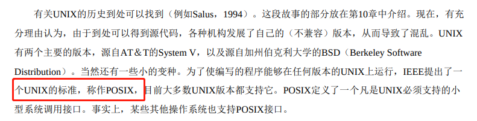

------

图形界面 X11

> 尽管许多UNIX用户，特别是富有经验的程序员们更偏好基于命令的界面而不是GUI，但是几乎所有的 UNIX系统都支持由MIT开发的称为X Windows的视窗系统（如众所周知的X11）。这个系统处理基本的视窗 管理功能，允许用户通过鼠标创建、删除、移动和变比视窗。对于那些希望有图形系统的UNIX用户，通常 在X 11之上还提供一个完整的GUI，诸如Gnome或KDE，从而使得UNIX在外观和感觉上类似于Macintosh或 Microsoft Windows。

------

android 是 2008 年出的。

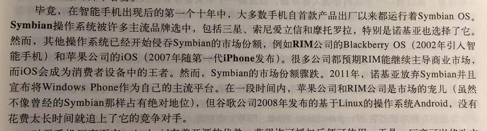

------

流水线设计。

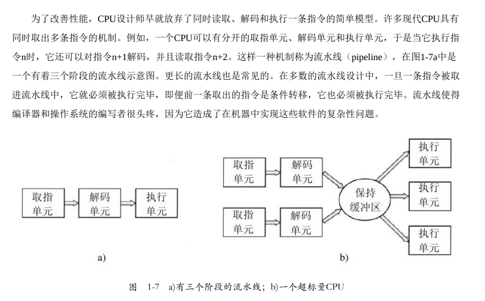

------

各种汇编书籍一直没讲如何操作磁盘IO，只是讲了怎么从内存读数据。这个是因为 在用户态中有关I/O和内存保护的所有指令是禁止的。

> 相反，用户程序在用户态下运行，仅允许执行整个指令集的一个子集和访问所有功能的一个子集。一般 而言，在用户态中有关I/O和内存保护的所有指令是禁止的。当然，将PSW中的模式位设置成内核态也是禁 止的。

------

多线程是 CPU 提供的东西。

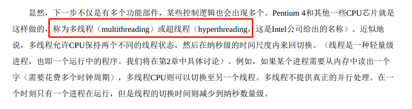

------

寄存器不是 CPU，寄存器可以看成是一个超高速内存。

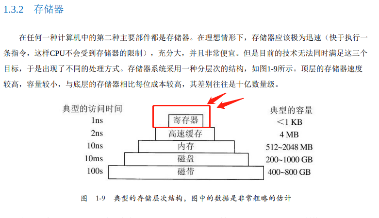

------

高速缓存需要两个时钟周期。

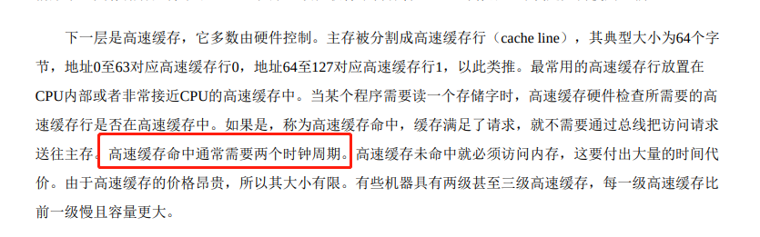

------

> 对于CPU缓存中的主存缓存行，每当有缓存未命中 时，就会调入新的内容

------

EFLAGS 寄存器 不能手动修改各个位的值，例如 `MOV $0xFF00,%eflags` 这条命令会报错，有个特殊的位 trap，可以用 trap 指令修改。trap 指令的语法先埋个坑，后面再填。

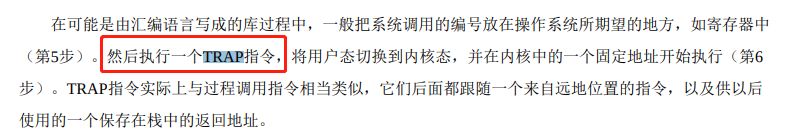

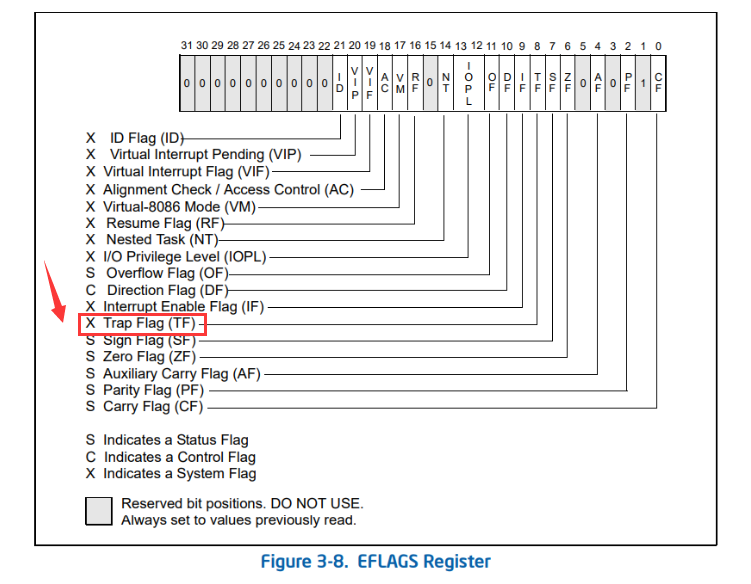

------

x86 硬件结构。

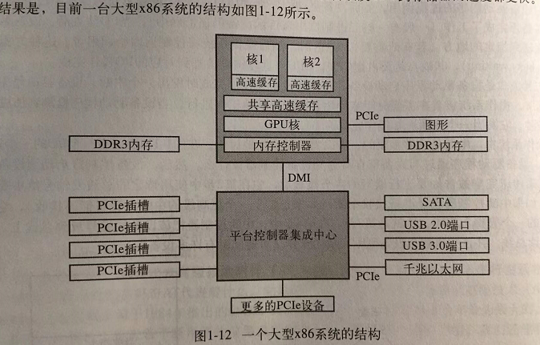

------

操作系统干的事情非常多。

> 然后，操作系统询问BIOS，以获得配置信息。对于每种设备，系统检查对应的设备驱动程序是否存 在。如果没有，系统要求用户插入含有该设备驱动程序的CD-ROM（由设备供应商提供）。一旦有了全部的 设备驱动程序，操作系统就将它们调入内核。然后初始化有关表格，创建需要的任何背景进程，并在每个终 端上启动登录程序或GUI。

------

汇编操作IO文件，通常是用系统调用，汇编指令集有指令可以进行文件操作，但是太麻烦。

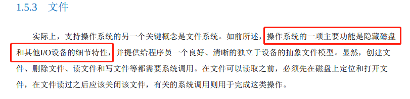

------

> 在实例中，每个进程有一个工作目录（working directory），其中，路径名不以斜线开始。如在图1-14中 的例子，如果/Faculty/Prof.Brown是工作目录，那么Courses/CS101与上面给定的绝对路径名表示的是同一个 文件。进程可以通过使用系统调用指定新的工作目录，从而变更其工作目录。

------

Linux 特殊文件：块特殊文件（block special file）和字符特殊文件（character special file）

> 在UNIX中，另一个重要的概念是特殊文件（special file）。提供特殊文件是为了使I/O设备看起来像文件一般。这样，就像使用系统调用读写文件一样，I/O设备也可通过同样的系统调用进行读写。有两类特殊文件：块特殊文件（block special file）和字符特殊文件（character special file）。块特殊文件指那些由可随机存取的块组成的设备，如磁盘等。比如打开一个块特殊文件，然后读第4块，程序可以直接访问设备的第4 块而不必考虑存放该文件的文件系统结构。类似地，字符特殊文件用于打印机、调制解调器和其他接收或输 出字符流的设备。按照惯例，特殊文件保存在/dev目录中。例如，/dev/lp是打印机（曾经称为行式打印 机）。

------

windows 的 Explorer 原来是一个 GUI 程序。

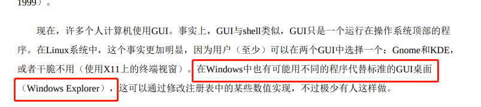

------

高速缓存。

> 特别地，技术的变化会导致某些思想过时并迅速消失，这种情形经常发生。但是，技术的另一种变化还 可能再次复活某些思想。在技术的变化影响了某个系统不同部分之间的相对性能时，情况就会是这样。例 如，当CPU远快于存储器时，为了加速“慢速”的存储器，高速缓存是很重要的。某一天，如果新的存储器技 术使得存储器远快于CPU时，高速缓存就会消失。而如果新的CPU技术又使CPU远快于存储器时，高速缓存 就会再次出现。在生物学上，消失是永远的，但是在计算机科学中，这一种消失有时不过只有几年时间。

------

虚拟内存的动态库。

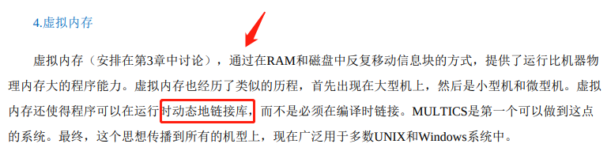

------

混淆不清的一般性描述。

------

> 记住下列事项是有益的。任何单CPU计算机一次只能执行一条指令。如果一个进程正在用户态中运行一 个用户程序，并且需要一个系统服务，比如从一个文件读数据，那么它就必须执行一个陷阱或系统调用指 令，将控制转移到操作系统。操作系统接着通过参数检查，找出所需要的调用进程。然后，它执行系统调 用，并把控制返回给在系统调用后面跟随着的指令。在某种意义上，进行系统调用就像进行一个特殊的过程 调用，但是只有系统调用可以进入内核，而过程调用则不能。

------

C/C++ 编译器规则：

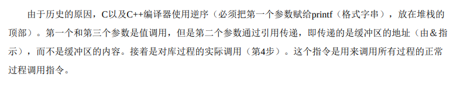

------

execve 就是 fork()。

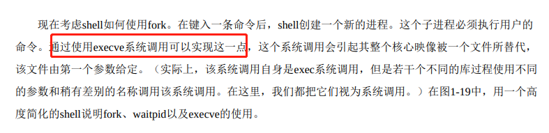

------

main 传递环境变量。

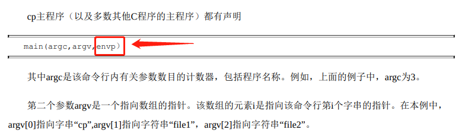

------

vm370 虚拟机

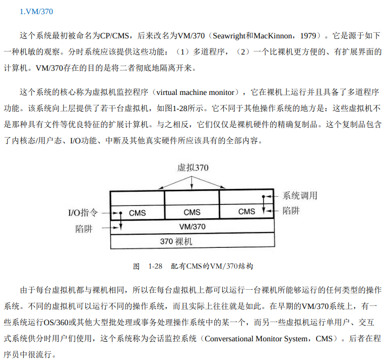

------

CPU 虚拟化 Popek和Goldberg

> 现在考察软件。虚拟机的吸引力是没有争议的，问题在于实现。为了在一台计算机上运行虚拟机软件，其CPU必须被虚拟化（Popek和Goldberg，1974）
>

------

由于笔者的水平有限， 加之编写的同时还要参与开发工作，文中难免会出现一些错误或者不准确的地方，恳请读者批评指正。如果读者有任何宝贵意见，可以加我微信 Loken1。QQ：2338195090。
