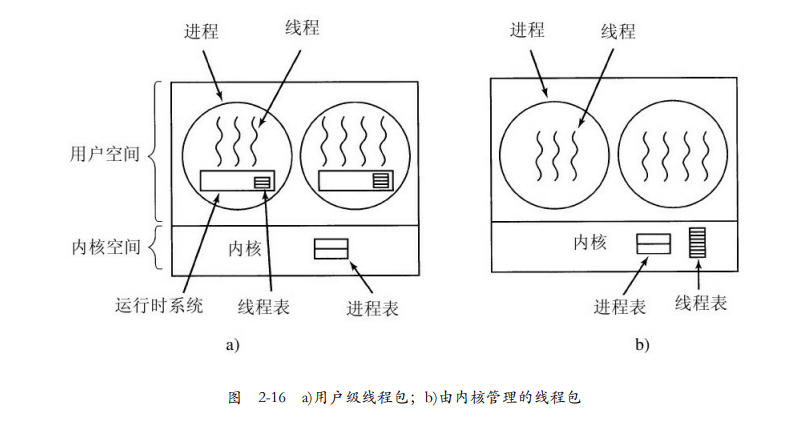

# 《现代操作系统》学习笔记-进程线程

下图是进程实现，切换进程的时候，这些全部玩意都要压进去内存。

------

为什么需要线程？

------

多线程的性能。

------

另一个线程定时保存数据。

------

信号处理 就是 中断驱动程序设计模型。

------

这就是有限状态机？

------

CPU 支持多线程，纳秒级切换。

> 正如我们在第1章中看到的，一些CPU已经有直 接硬件支持多线程，并允许线程切换在纳秒级完成。

------

thread_yield 实际上跟 SRS 要做的 yield 一样，就是让程序检查其他处于就绪状态（ runable） 的协程/线程，如果有就调用其他的，没有就继续执行自己的，这个并不是进入 idle 线程进行epoll调度，yield 不会阻塞在 epoll 里面。

------

进程1 里面如果有3个线程，线程 A，线程B，线程C，线程A处于密集计算，他不会主动让出CPU 给线程B，即使这个线程A已经 持续运行了10几秒。就跟 协程A运行了2~3秒还未完成一样，就需要 yield 让出时间片。C语言是 **sched_yield**() 可以主动让出时间片。

在一个4核CPU上开8个线程进行数据密集型计算，然后第 9 个线程定时写文件日志，第9个线程应该只能拿到很少的时间片。

补充，线程是内核调度的，应该不可能持续运行10几秒不让处理。

------

线程也在程序设计模式中引入了某种程度的复杂性。

> 通常而言，线程是有益的，但是线程也在程序设计模式中引入了某种程度的复杂性。考虑一下UNIX中 的fork系统调用。如果父进程有多个线程，那么它的子进程也应该拥有这些线程吗？如果不是，则该子进程 可能会工作不正常，因为在该子进程中的线程都是绝对必要的。 然而，如果子进程拥有了与父进程一样的多个线程，如果父进程在read系统调用（比如键盘）上被阻塞 了会发生什么情况？是两个线程被阻塞在键盘上（一个属于父进程，另一个属于子进程）吗？在键入一行输入之后，这两个线程都得到该输入的副本吗？还是仅有父进程得到该输入的副本？或是仅有子进程得到？类 似的问题在进行网络连接时也会出现。

------

用户级线程，也就是协程。

------

这个表特别有意思，进程中的多线程，跟内核中的多进程。

------

切换线程是运行时系统做的，应该就是 libc。

> 当某个线程做了一些会引起在本地阻塞的事情之后，例如，等待进程中另一个线程完成某项工作，它调 用一个运行时系统的过程，这个过程检查该线程是否必须进入阻塞状态。如果是，它在线程表中保存该线程 的寄存器（即它本身的），查看表中可运行的就绪线程，并把新线程的保存值重新装入机器的寄存器中。只
>

------

进程内多个线程调度，比多进程单线程调度更快。

------

注意一下缺页中断：

------

多线程创建一个新的进程，疑问：

> 虽然使用内核线程可以解决很多问题，但是不会解决所有的问题。例如，当一个多线程进程创建新的进 程时，会发生什么？新进程是拥有与原进程相同数量的线程，还是只有一个线程？在很多情况下，最好的选 择取决于进程计划下一步做什么。如果它要调用exec来启动一个新的程序，或许一个线程是正确的选择；但 是如果它继续执行，则应该复制所有的线程。

------

内核线程 + 用户级线程 混合实现，就是 go 跟 srs，多线程 + 多协程。

------

有许多库过程并不是可重入的

> 试图将单一线程程序转为多线程程序的另一个问题是，有许多库过程并不是可重入的

------

屏蔽中断大法：结论是：屏蔽中断对于操作系统本身而言是 一项很有用的技术，但对于用户进程则不是一种合适的通用互斥机制。

------

自旋锁，不同的锁值作为判断条件。

------

Peterson解法

------

TSL 指令锁总线：

------

互斥锁的汇编实现：

------

数据库避免锁：读-复制-更新：

------

CPU 密集型，IO 密集型。

------

> 如果进程是I/O密集型的，则需要多运行一些这类进程以保持CPU的充分利用。

------

非抢占式系统就是实时系统。

------

TODO，研究一下实时系统的调度算法。

------

------

低优先级饥饿。

------

彩票调度算法优化音视频传输。

------

由于笔者的水平有限， 加之编写的同时还要参与开发工作，文中难免会出现一些错误或者不准确的地方，恳请读者批评指正。如果读者有任何宝贵意见，可以加我微信 Loken1。QQ：2338195090。
