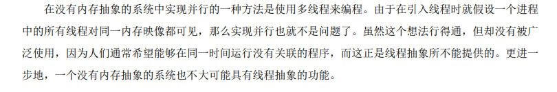
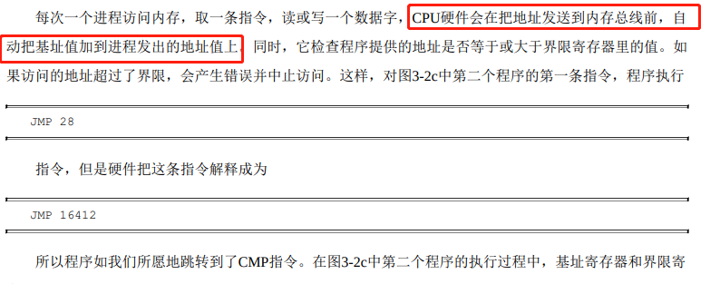
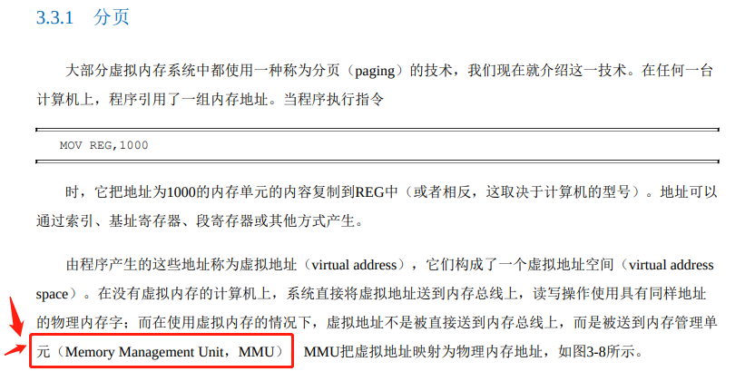
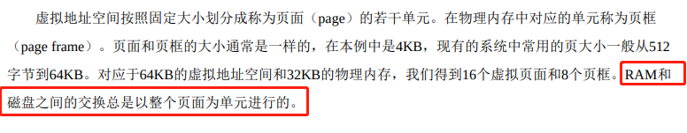
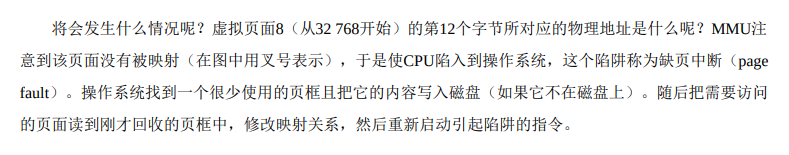
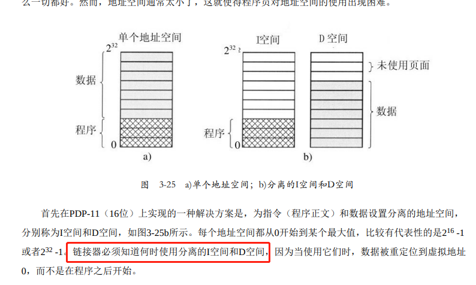
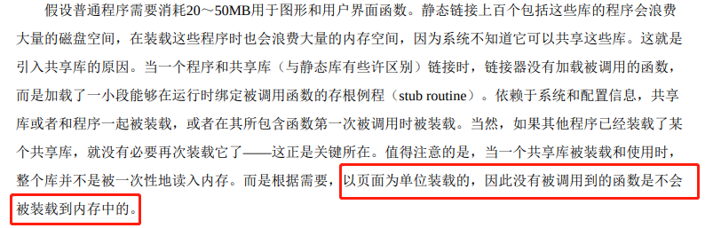
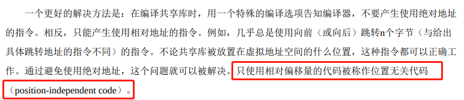
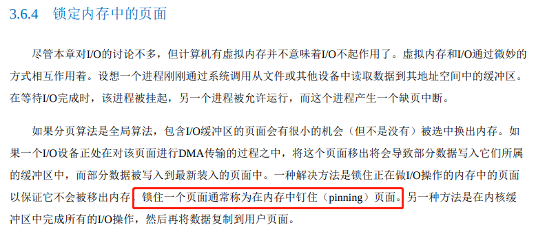
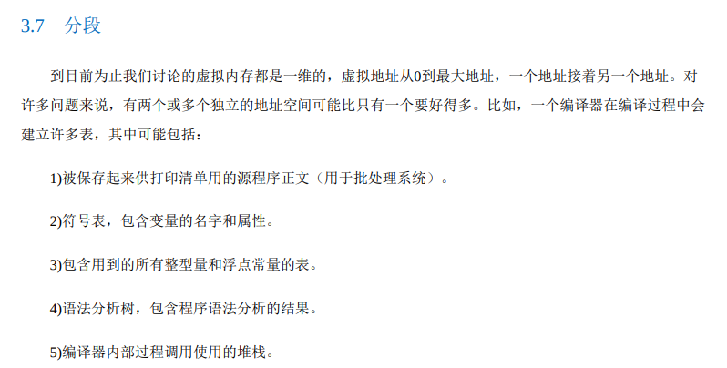

# 《现代操作系统》学习笔记-内存管理

为什么要对物理内存做抽象：

------

操作系统作为库实现。

> 操作系统作为库实现的常见例子如流行的e-cos操作系统

------

CPU 访问内存总线，自动附加基址。

------

进程的内存增长：

------

虚拟内存原来需要 MMU 芯片的支持，

------

内存与磁盘进行交换数据，是通过页单位的。

------

trap 陷入指令为了保护才设计出来的。trap 陷入操作系统会有比较大的消耗。缺页机制：

------

链接器与指令数据空间。

------

链接原理。

------

位置无关代码

------

特殊的CPU 寄存器中

> 我们终于可以讨论缺页中断发生的细节了。缺页中断发生时的事件顺序如下： 1)硬件陷入内核，在堆栈中保存程序计数器。大多数机器将当前指令的各种状态信息保存在特殊的CPU 寄存器中。

------

锁定内存中的页面

------

编译过程。

------

把文件看成一个地址空间。

> 文件是进程创建的信息逻辑单元。一个磁盘一般含有几千甚至几百万个文件，每个文件是独立于其他文 件的。文件不仅仅被用来对磁盘建模，以替代对随机存储器（RAM）的建模，事实上，如果能把每个文件 看成一种地址空间，那么读者就离理解文件的本质不远了。

------

------

由于笔者的水平有限， 加之编写的同时还要参与开发工作，文中难免会出现一些错误或者不准确的地方，恳请读者批评指正。如果读者有任何宝贵意见，可以加我微信 Loken1。QQ：2338195090。
