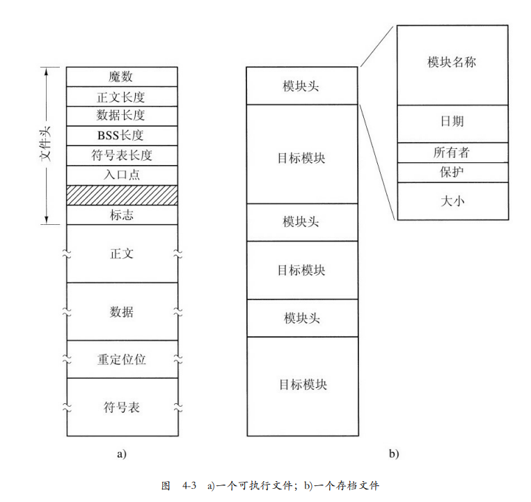
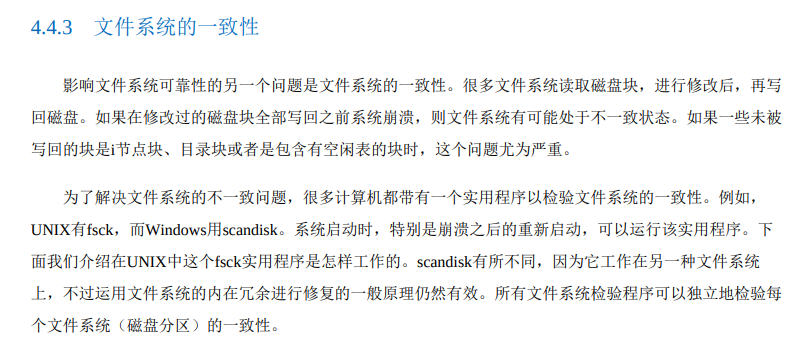

# 《现代操作系统》学习笔记-内存管理

可执行文件的结构，符号表用于调试，存档文件就是 archive，也就是静态库。

------

文件系统的一致性是重点，可以仔细研究：

------

读内存中一个32位字大概要10ns

------

MS-DOS 是一个文件系统：

------

时钟中断，来控制进程超时：

------

------

由于笔者的水平有限， 加之编写的同时还要参与开发工作，文中难免会出现一些错误或者不准确的地方，恳请读者批评指正。如果读者有任何宝贵意见，可以加我微信 Loken1。QQ：2338195090。
