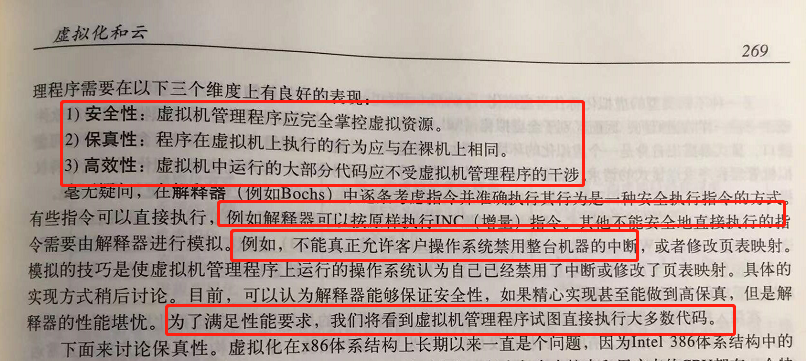

# 《现代操作系统》学习笔记-虚拟化和云

虚拟化中的解释器，虚拟机中 的程序运行的某些汇编并不是真正的指令，而是一个模拟，不能允许程序中的指令禁用整个机器的中断：

------

虚拟化难题需要被 CPU 解决。

------

二进制翻译技术：

------

二进制改写：

------

嵌套页表的硬件支持 EPT。

------

虚拟化，系统切换，只需 45条汇编指令。

------

------

由于笔者的水平有限， 加之编写的同时还要参与开发工作，文中难免会出现一些错误或者不准确的地方，恳请读者批评指正。如果读者有任何宝贵意见，可以加我微信 Loken1。QQ：2338195090。
