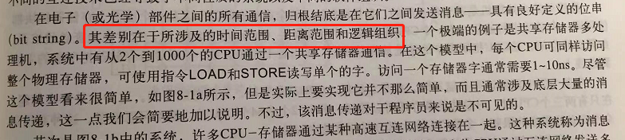
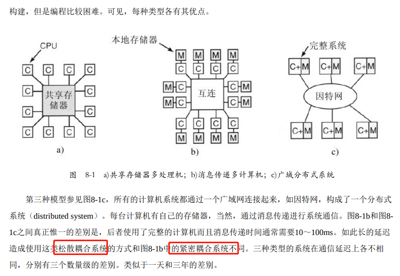
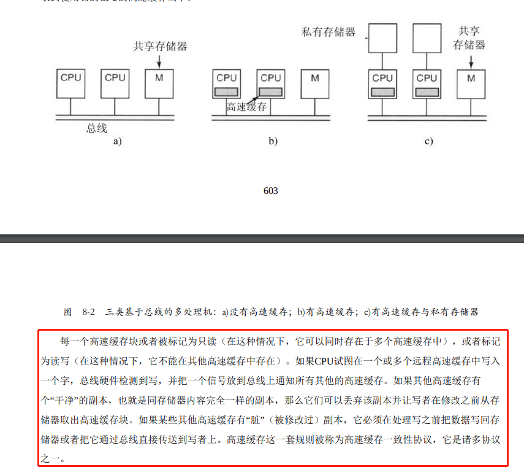
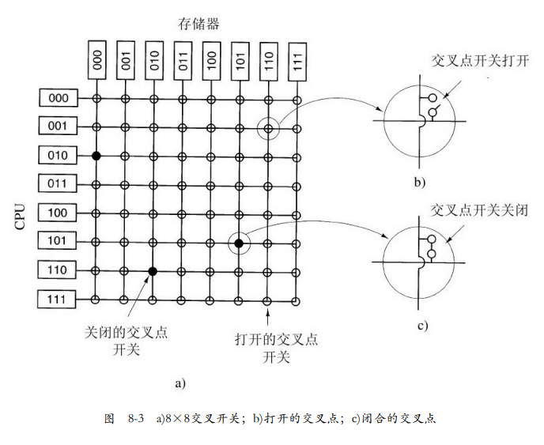
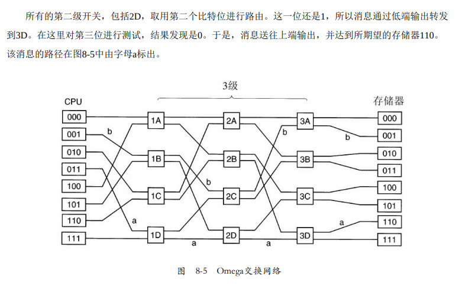
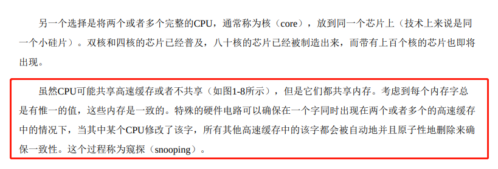
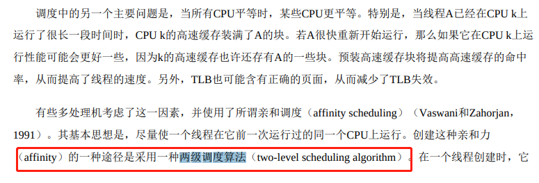

# 《现代操作系统》学习笔记-多处理机系统

多处理机的时间范围，距离范围和逻辑组织。

------

松散耦合系统 与 紧密耦合系统。

------

各个CPU的高速缓存原来是用只读来实现并行，要写就需要竞争总线。

------

编译器 把只读数据放进去私有存储器，共享存储器只用于可写的共享变量。

------

各个 CPU 核心通过连线减少 对内存访问的竞争状态。通俗来说，就是内存被连线分成多个小单元，CPU1 读写 内存单元A，CPU2 读写内存单元B，经过的连线不同，所以可以并行操作，如果连线交叉就会进入竞争状态，其中一个CPU核心需要等待另一个核心完成操作，如下图：

------

高速缓存一致性，嗅探。

------

两级调度算法。

------

图论确定算法。

------

------

由于笔者的水平有限， 加之编写的同时还要参与开发工作，文中难免会出现一些错误或者不准确的地方，恳请读者批评指正。如果读者有任何宝贵意见，可以加我微信 Loken1。QQ：2338195090。
