# 《现代编译原理》学习笔记

这本书感觉像是提供给教师教学的书籍。没有提供源代码，不过 github 有个人放了一些源码，[modern-compiler](https://github.com/ejacky/modern-compiler)，可以结合源码看这本书。

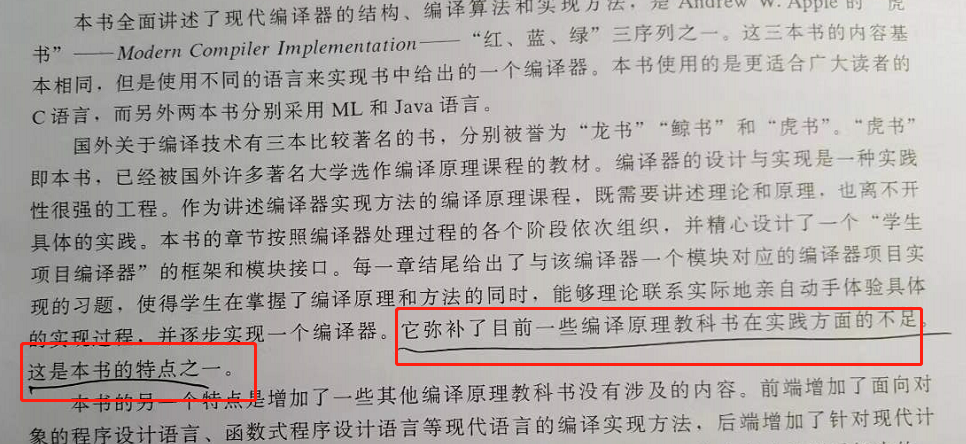

------

编译器辅助 高速缓存。

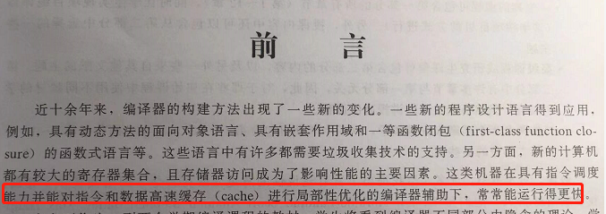

------

有限自动机 全称 deterministic finite automaton，我刚开始接触这个词时候，以为是特别复杂的概念，但其实不是，就是一些状态的集合。例如开始状态是A，可能会从 A 转成 B 状态，也可能从 A 转成 C状态。这个状态是有限的，所以是 finite 。然后再讲解一下这个 deterministic 这个词代表的意思是 最终的状态，只有一个最终状态。

可能这样讲还是有点迷糊，有限自动机在词法分析比较常用，再通俗一点讲，就是在扫描分析ASII码文本的使用比较常用。例如 第一个字是 “你”，“你” 就是开始状态A，第二个状态是什么，有可能是 "好"，也可能是 ”坏“，”好“是 B状态，”坏“ 是 C 状态。

你甚至可以把有限自动机 理解成一堆 if else 的逻辑。

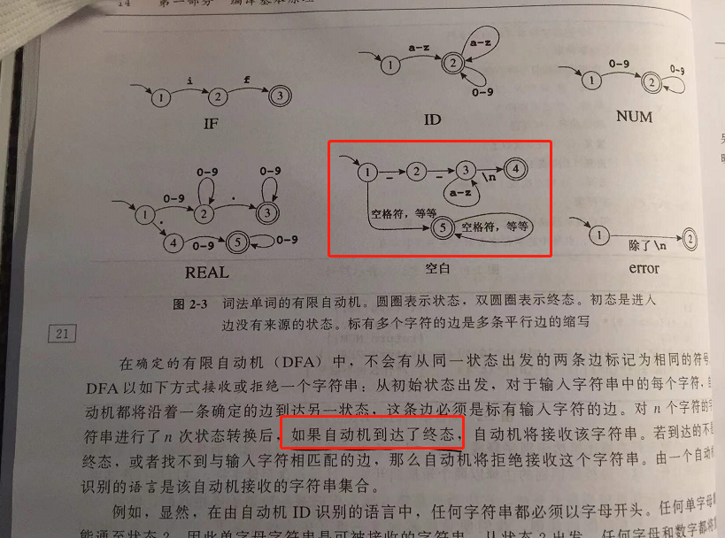

------

编译技术 跟 NLP 是有蛮多相似之处的，大家都是扫描一段字符串文本（例如ASII码），然后分词，编译系统把分词算法叫做 词法分析。然后 NLP 跟 编译系统都要做语法分析，语法如果错误编译直接报错。然后是语义分析，这些 词（Token）组合起来要表达的意思是什么。 

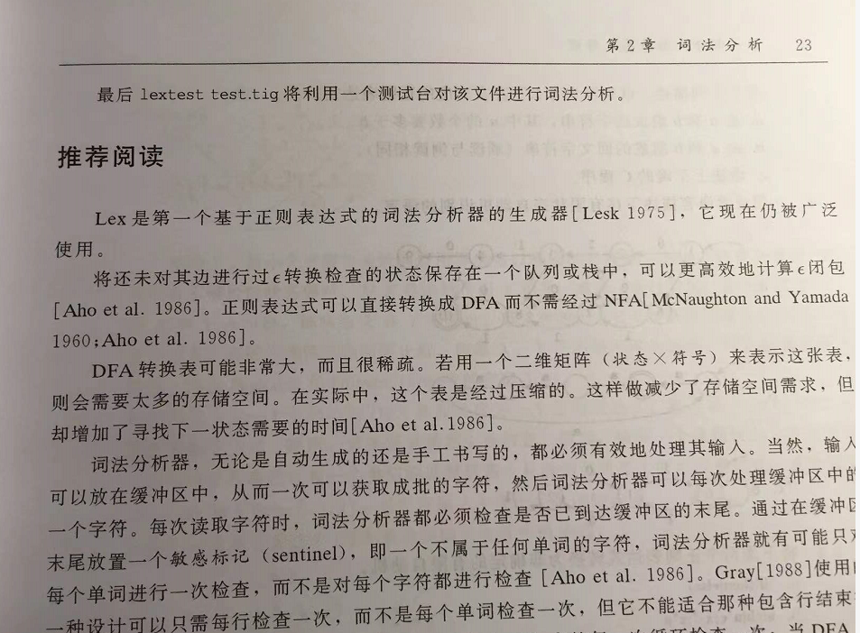

------

中间代码表示。

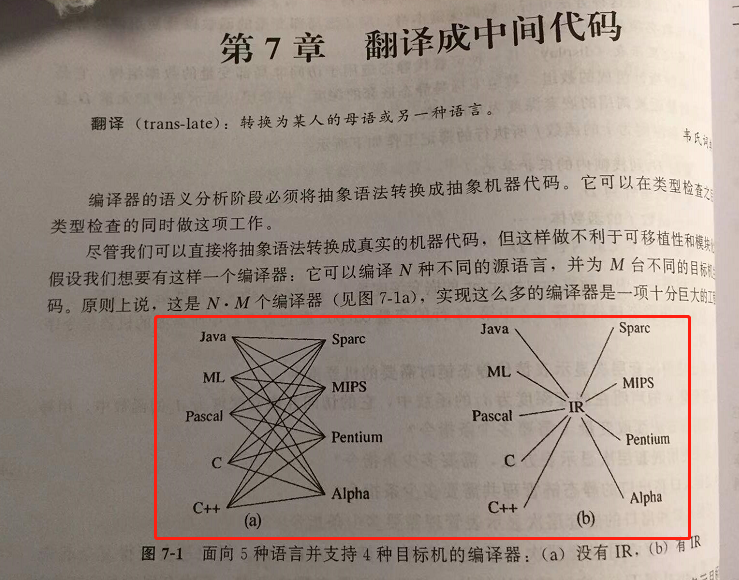

------

编译系统的局限性：抽象语法的复杂部分并不总是能正好与机器能执行的复杂指令相对应。

这句话通俗来讲，就是编译系统他通常编译不出来 复杂的汇编指令，例如点积的汇编指令，编译系统只能用加减乘除这些简单操作 来 拼接成点积算法。甚至有时候求平均，编译系统也是用 加除 两条简单指令完成，没有编译出 pavgb 复杂的指令。

所以对于 CISC 架构的CPU，也就是提供了 复杂指令 跟 SMID 的CPU，想榨干性能，通常会手写SMID 汇编程序，或者使用 intrinsic 让编译系统辅助写 SMID 程序。在 FFmpeg 里面经常能看到大量汇编代码。

复杂指令实际上是 CPU 提供的高性能指令，CPU把很多简单操作集成在内部进行优化。通过一个大指令完成更复杂的事情，通常大指令 会比 简单指令需要更多的 CPU周期，但是整体而言，大指令还是比多个简单指令性能高。因为CPU帮你做了优化。

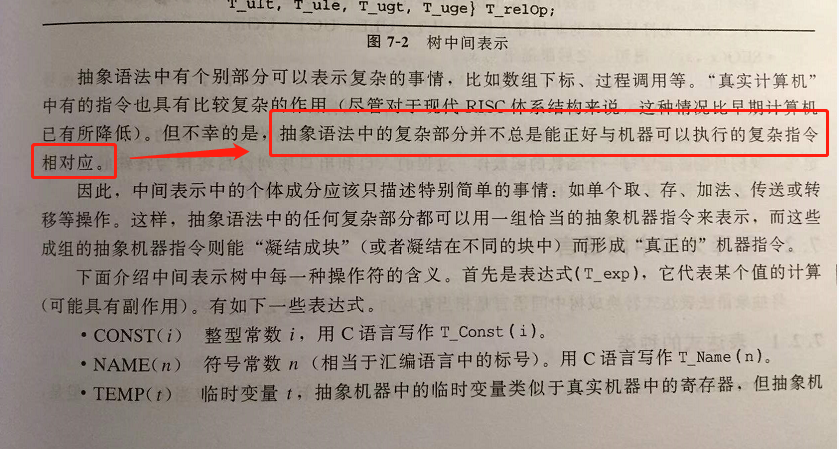

------

取 跟 加 在抽象语法树里面是两个操作，但是通常汇编一条指令即可完成。

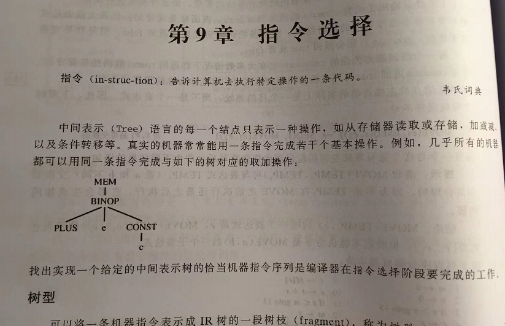

------

第18章，循环优化，了解一下。

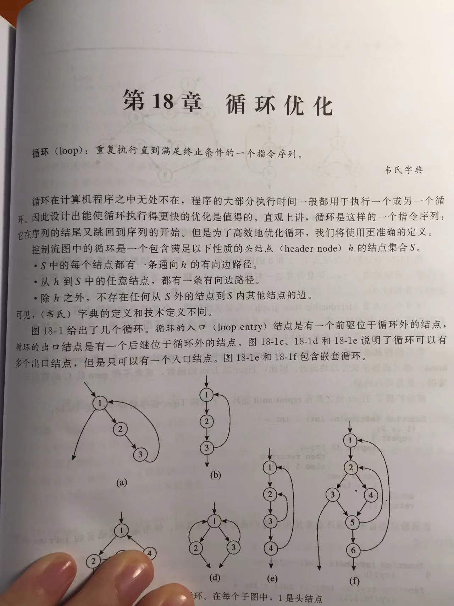

------

我们在断点调试一个程序的时候，如果开启 GCC 编译优化，代码跳转会很奇怪，这是因为编译系统改变了代码运行顺序，把没有数据依赖的指令合在一起了，就能充分利用CPU的指令级并行技术。

指令级并行技术跟 软件工程思维是相悖的，我们写代码通常习惯把不同功能的函数分开两个函数，或者分成两个区块来写，两个功能的代码肯定依赖少，甚至没有依赖。但是指令级并行技术，需要相邻的指令是无依赖的，那只能把不同功能的代码合起来弄成相邻的，这个事情最好由编译系统完成。人工合并无依赖的相邻指令太悲催了。

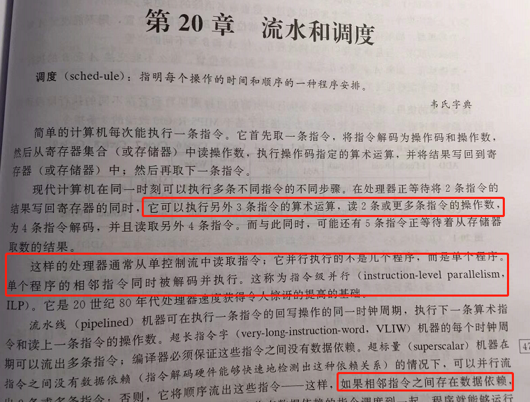

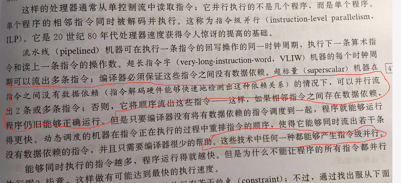

一个CPU 里面有可能有多个加法单元。

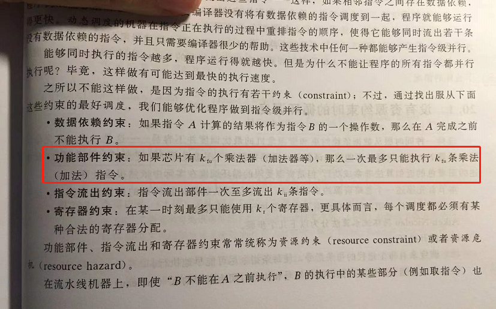

------

我以前一直不太理解，为什么存储器靠近CPU，就能提高速度。这是因为物理世界任何物质传输都有一个速度，光速，音速，等等，电子在电路中也有传输速度，就好像快递从1环送到2环，是不是比送到3环快？

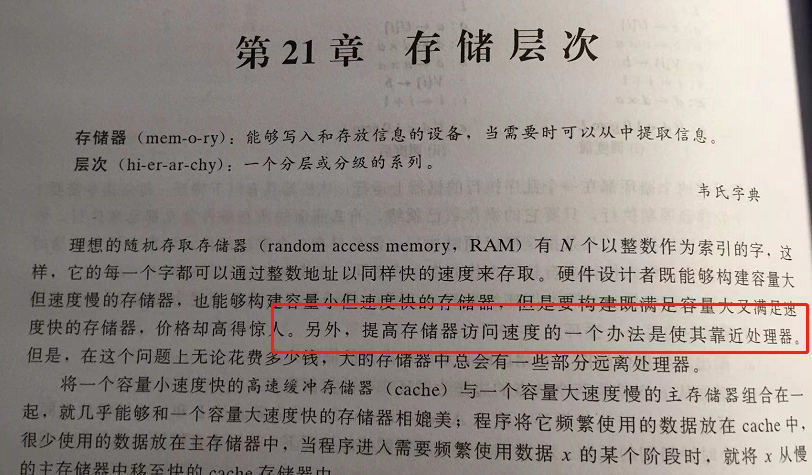

------

------

由于笔者的水平有限， 加之编写的同时还要参与开发工作，文中难免会出现一些错误或者不准确的地方，恳请读者批评指正。如果读者有任何宝贵意见，可以加我微信 Loken1，QQ：2338195090。

