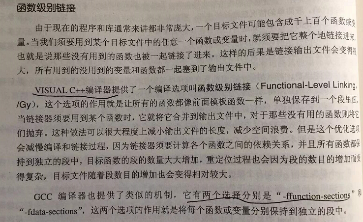

# 《程序员的自我修养》学习笔记-第3、4章

弱引用：

特殊符号：

明明冲突的解决方法：

C++ filt 工具。

C++ ABI 。

修饰符处理。

DWARF 标准：

ld 的 默认入口函数是 _start()

call 指令的操作数是偏移量，不是真正的地址，真正的地址需要计算。

符号解析：

C++ link once 最终链接。

函数级别链接：

main 之前的执行流程：

Windows 的库。

collect2 是对 ld 的一个封装。

静态链接 只会链接需要的内容，libc.a  5.8M，但实际不会完全链接进去。

链接脚本：

BFD 库。

------

由于笔者的水平有限， 加之编写的同时还要参与开发工作，文中难免会出现一些错误或者不准确的地方，恳请读者批评指正。如果读者有任何宝贵意见，可以加我微信 Loken1，QQ：2338195090。

