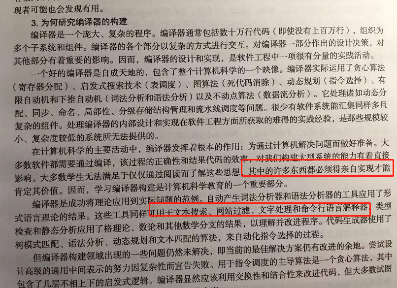
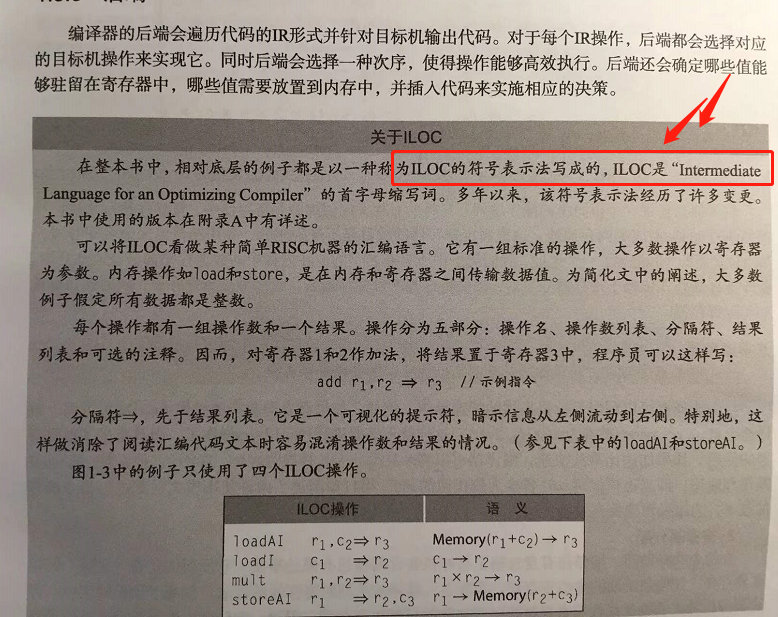
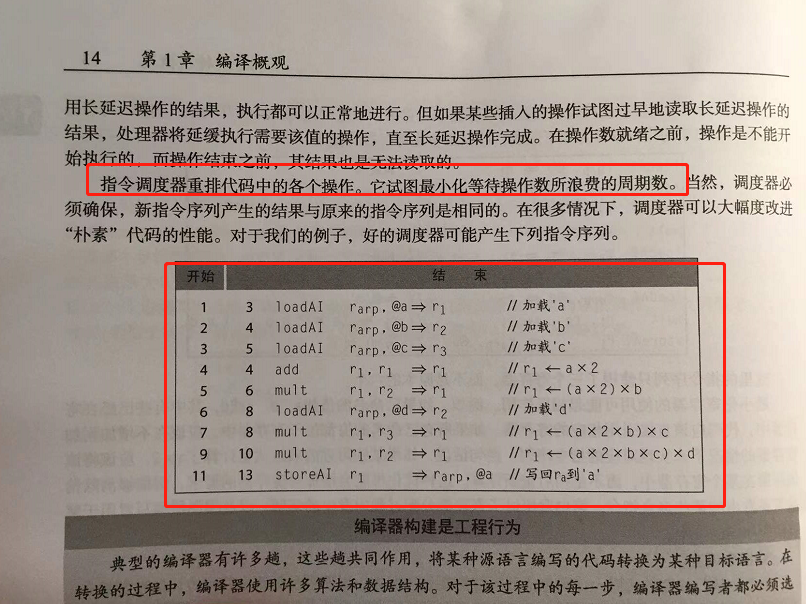

# 《编译器设计》学习笔记

许多东西必须得亲自实现才能肯定其价值。这些工具通用可用于文本搜索，网站过滤，文字处理和命令行语言解释器。

------

ILOC 语言。

------

重排无依赖指令。

------

------

由于笔者的水平有限， 加之编写的同时还要参与开发工作，文中难免会出现一些错误或者不准确的地方，恳请读者批评指正。如果读者有任何宝贵意见，可以加我微信 Loken1，QQ：2338195090。

