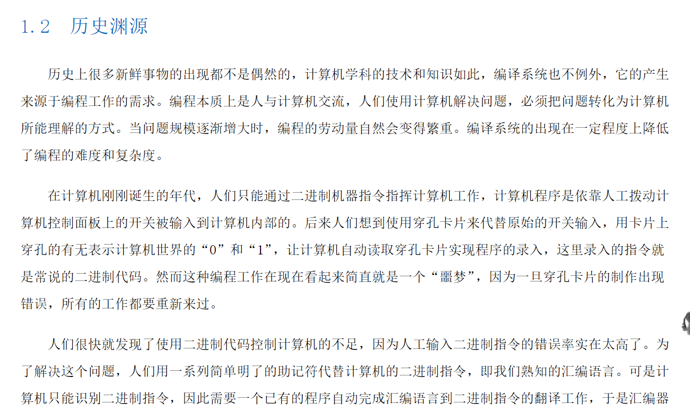
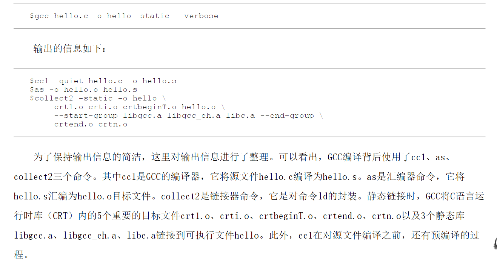

# 《自己动手构造编译系统》学习笔记1

为什么会发展出来汇编器，链接器，为什么不直接写机器码指令。因为工程如果越来越大，机器码会很难维护，汇编器，链接器是为了让大工程能够开发出来，而且错误率更低。高级语言是也是为了降低错误率，提高开发效率，但是有时候 C语言还是会嵌入汇编，那是为了某个模块的性能，说句不好听的话，虽然编译系统很复杂，但是并不是特定聪明，他是牺牲性能来实现易用性，他只是把复杂度封装在编译系统里面。例如如果不用 instrinc 助记符，编译系统基本编译不出来SIMD指令，这些指令是CPU为了特定算法提供的，例如音视频编解码。

------

GCC 的内部流程。

------

.o 文件为什么叫 可重定位文件，是因为这个文件里面有位置信息，可以被链接器使用。

------

由于笔者的水平有限， 加之编写的同时还要参与开发工作，文中难免会出现一些错误或者不准确的地方，恳请读者批评指正。如果读者有任何宝贵意见，可以加我微信 Loken1，QQ：2338195090。

