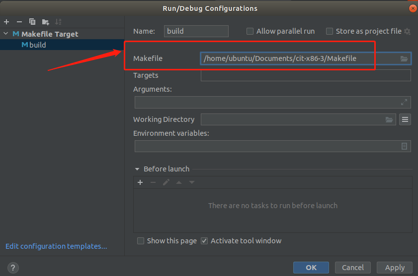

# 《自己动手构造编译系统》学习笔记2

我花了两天时间把《自己动手构造编译系统》这本书快速过了一遍，里面很多概念思路作者讲得不错，但是跟代码比较脱离，所以本文主要讲如何在 Ubuntu CLion 的集成环境下调试这本书的源代码，结合源码调试看这本书效率会更高一些。源代码下载地址：[cit](https://github.com/fanzhidongyzby/cit) 。

源码目录如下，


这个项目有一个do 的 shell 脚本，代码如下，执行即可编译项目

```
#/bin/sh
echo 更新编译器
cd ./compiler
make
cd ..
echo 生成编译程序./compiler/compiler
echo 更新汇编器
cd ./ass
make
cd ..
echo 生成汇编程序./ass/ass
echo 更新链接器
cd ./lit
make
cd ..
echo 生成链接程序./lit/lit
echo 更新命令控制
make
echo 生成命令控制程序./cit 
```

从上面的代码可以看到，实际上就是执行 make，生成不同的程序，一共有4个程序。

1. compiler，C程序员翻译器，把C程序翻译成汇编指令。
2. ass，汇编程序翻译器，把汇编程序翻译成 机器码
3. lit，链接器
4. cit，cit 是一个总的管理器，内部调 compiler，ass，lit 完成工作。

------

执行完 do 的 shell 脚本之后，就会生成 `cit` 可执行文件，如下：


`cit` 程序是通过根目录的 `main.c` 生成的，里面根据需要调取不同的命令，如下：


------

因为 `exeCmd()` 函数里面调的是 system() 函数，所以会再开一个进程运行 `compiler` 程序，这样不太方便调试，暂时就先配置 `cit` 程序在 `CLion` 的调试环境。

新建一个文件 `hello.c` ，代码如下：

```
#include <stdio.h>
int main() {
    printf("Hello World!");
    return 0;
}
```

用以下命令把这个 C 程序翻译成 汇编代码：

```
./cit hello.c hello.s -s
```

上面这句命令，一运行就会报错，如下：


这是 因为 `cit` 编译器只支持部分语法，我找了一会，作者放了一个文件 `file/test.c` ，这个文件是可以编译通过的，执行以下命令：

```
./cit ./file/test.c test -s
```

即可在 work 目录生成 汇编文件 `test.s`，如下：


`test.c` 里面用的 `out` 打印，应该是自己创的语法。

------

现在已经知道 `cit` 程序的基本用法，现在就开始搭建 Clion 的调试环境。用 CLion 打开项目，如下：


点击右上角的 Add Configuration，如下：


选择 Makefile Target ，配置如下图：



上图中的 Targets 留空即可，make 会选择第一个 target 来编译。


直接点击右上角的运行按钮，即可编译出 cit 文件，这个其实跟手动执行 make 一样的。编译出 可执行文件之后，clion 就能 调 gdb 来调试这个 cit 文件。

现在要添加一个 `Makefile Application` ，如下图：


上图有一个重点，就是那个 Target ，**我原来是没有 Target 的**，要点后面那个设置按钮，自己加，如下图：


按上图这样填好 `target` 就行了，为什么要这样填，我也不知道，按理 Clion 直接调 GDB 调试我 指定的执行文件就行了。不管这个，总之 按我上图这样 填好 `target`，他 Clion就不会报错。

然后就可以运行调试了，如下：


因为里面调了 compiler 程序，所以会报错，还是要运行一下 那个自带的 do 脚本，生成 compiler。

现在就可以调试，直接在 `main.c` 打一个断点，如下图：


现在这种情况 只能调试 cit 的代码，`compiler` 程序是 `system()` 函数调用的，所以不太方便调试。直接看 `cit` 是怎么传参给  `compiler` 的，安装同样的方法配置一下，也可以调试 `compiler`。


断点看到 compiler 的用法如下：

```
cd ./compiler
./compiler /home/ubuntu/Documents/cit-x86-3/file/test.c
```

一定要进入 compiler 目录运行，要不然会报错，因为他里面用了 `common.c` 的相对路径。

现在再配置一个 compiler 程序的 `Makefile Application` ，一定要填对 Working directory，如下图：


断点调试如下：


现在就可以一步一步调试这个 编译器了。

这个项目美中不足的是，提供的测试代码比较少，只有一个 `test.c` 文件。

------

由于笔者的水平有限， 加之编写的同时还要参与开发工作，文中难免会出现一些错误或者不准确的地方，恳请读者批评指正。如果读者有任何宝贵意见，可以加我微信 Loken1，QQ：2338195090。

