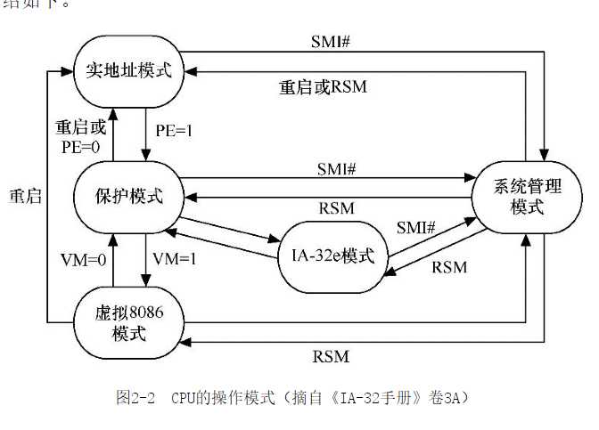
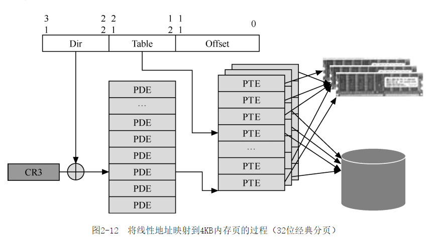
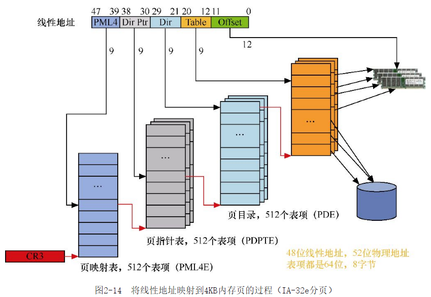

# 《软件调试卷一》学习笔记2

CPU 的操作模式。

汇编的 rep 指令，

> rep movs dword ptr es:[edi],dword ptr [esi]

CR2 跟 CR3 寄存器实现虚拟内存。

> CR2和CR3都与分页机制有关，是实现虚拟内存的基础。简单来说，CR3用来切换和定位当前正在使用的页表。当软件访问某个内存地址时，CPU会通过页表做地址翻译，当访问的内存不在物理内存中而报告缺页异常时，CPU会通过CR2向操作系统报告访问失败的线性地址。在一个多任务的系统中，通常每个任务都有一套相对独立的页表

> 所谓任务，从CPU层来看就是CPU可以独立调度和执行的程序单位。从Windows操作系统的角度来看，一个任务就是一个线程（thread）或者进程（process）。

CPU 里面本身就有数据结构，CPU 本身就是一个微型操作系统。最近在看《软件调试》，发现原来 CPU 内部本身也有数据结构，线性表之类的。

如果说实现了一些算法逻辑，跟使用了数据结构的设备是 system的话，一块 CPU 本身就是一个 system。例如 intel I7 本身就是一个微型系统。

> 根据用途不同，IA-32处理器有3种描述符表：全局描述符表（Global Descriptor Table，GDT）、局部描述符表（Local Descriptor Table，LDT）和中断描述符表（Interrupt Descriptor Table，IDT）。

> 因为Windows系统使用分页机制来实现虚拟内存，所以段的存在标志不再起重要作用，

线程 TEB 表的作用。

> TEB中保存着当前线程的很多重要信息，很多系统函数和API是依赖这些信息工作的，包括著名的GetLastError() API，其反汇编代码如下

实现虚拟内存有两种方法。段机制 与 分页机制。

> IA处理器从386开始支持分页机制（paging）。分页机制的主要目的是高效地利用内存，按页来组织和管理内存空间，把暂时不用的数据交换到空间较大的外部存储器（通常是硬盘）上（称为page out，换出），需要时再交换回来（称为page in，换进）。在启用分页机制后，操作系统将线性地址空间划分为固定大小的页面（4KB、2MB、4MB等）。每个页面可以被映射到物理内存或外部存储器上的虚拟内存文件中。尽管原则上操作系统也可以利用段机制来实现虚拟内存，但是因为页机制具有功能更强大、灵活性更高等特点，今天的操作系统大多都是利用分页机制来实现虚拟内存和管理内存空间的。深入理解分页机制是理解现代计算机软硬件的一个重要基础。

虚拟内存功跟物理内存的对应关系在 62 页。

根据 cr3 寄存器找出哪个进程产生的 coredump。

> 这说明产生转储时，当前进程就是ImBuggy进程，事实上是这个进程调用驱动程序realbug.sys导致系统蓝屏崩溃，崩溃后，系统自动产生了这个转储文件。

windgb 的 !db 命令可以直接查看物理内存的内容。

>  综合 以上 结果， 线性 地址 f8c2e04d 的 物理 地址 是 0x0d56604d， 使用 !db 命令 观察 这个 物理 地址：
>

intel 64架构，内存映射图。

PC 系统架构的转变。

> 近几年，PC系统的芯片架构有所变化，MCH芯片消失，它的内存管理器和集成显卡部分向上被集成到CPU芯片中，总线控制器和其他部分向下与ICH合成在一起，称为PCH（Platform Controller Hub）。总体来看，由原来的“CPU + MCH + ICH”的三芯片架构演变为“CPU + PCH”的双芯片架构。

动态语言代码加速。

> 引入更好执行动态语言代码的ThumbEE技术。

中断就是打断 CPU 的执行。

> 中断通常是由CPU外部的输入输出设备（硬件）所触发的，供外部设备通知CPU“有事情需要处理”，因此又称为中断请求（interrupt request）。中断请求的目的是希望CPU暂时停止执行当前正在执行的程序，转去执行中断请求所对应的中断处理例程（Interrupt Service Routine，ISR）。
> 考虑到有些任务是不可打断的，为了防止CPU这时也被打扰，可以通过执行CLI指令清除标志寄存器的IF位，以使CPU暂时“不受打扰”。但有个例外，这样做只能使CPU不受可屏蔽中断的打扰，一旦有不可屏蔽中断（Non-Maskable Interrupt，NMI）发生时，CPU仍要立即转去处理。不过因为NMI中断通常很少发生，而且不可打断代码通常也比较短，所以大多数情况下还是不存在问题的。可屏蔽中断请求信号通常是通过CPU的INTR引脚发给CPU的，不可屏蔽中断信号通常是通过NMI引脚发给CPU的。

系统时钟是通过中断实现的，IRQ0。

> 根据从最初的个人计算机（IBM PC）系统传承下来的约定，IRQ0通常是分配给系统时钟的，IRQ1通常是分配给键盘的，IRQ3和IRQ4通常是分配给串口１和串口2的，IRQ6通常是分配给软盘驱动器的

查看进程的缺页次数。

> 在Windows这样的操作系统中，缺页异常每秒钟都发生很多次。在Windows系统中按Ctrl + Shift + Esc组合键，打开任务管理器，显示出PF Delta列（选择View→Select Columns），便可以观察缺页异常的发生情况

除零异常处理过程。

> 对于这个示例，当CPU执行到0040108B地址处的IDIV指令时，因为源操作数的值是零，所以CPU会检测到此情况，并报告除零异常。接下来CPU会把EFLAGS寄存器、CS寄存器和EIP寄存器的内容压入栈保存起来，然后转去执行除零异常对应的异常处理程序（如何找到处理程序的细节将在3.5节中讨论）

代码断点的检测逻辑。

> 代码断点错误异常，即从内存取指令时检测到与调试寄存器中的断点地址相匹配，也就是利用调试寄存器设置的代码断点

IDTR 寄存器。

> 首先，与IVT的位置固定不同，IDT的位置是变化的。保护模式中，CPU专门增加了一个名为IDTR寄存器来描述的IDT的位置和长度。

处理器初始化 Bootstrap Processor。

> 以上介绍的过程都是发生在0号处理器中的，也就是所谓的Bootstrap Processor，简称为BSP。因为即使是多CPU的系统，在把NTLDR或WinLoad及执行权移交给内核的阶段都只有BSP在运行。在BSP完成了内核初始化和执行体的阶段0初始化后，在阶段1初始化时，BSP才会执行KeStartAllProcessors函数来初始化其他CPU，称为AP（Application Processor）。对于每个AP，KeStartAllProcessors函数会为其建立一个单独的处理器状态区，包括它的IDT，然后调用KiInitProcessor函数，后者会根据启动CPU的IDT为要初始化的AP复制一份，并做必要的修改。

切换线程，是把整个线程信息切换。简单的 jmp 只是指令跳到另一个地方，上下文没有修改。

> 如果是任务描述符，那么CPU会执行硬件方式的任务切换，切换到这个描述符所定义的线程，如果是陷阱描述符或中断描述符，那么CPU会在当前任务上下文中调用描述符所描述的处理例程

以软件的方式切换线程。

> 在启动期间，Windows会为每个CPU创建3～4个TSS，一个用于处理NMI，一个用于处理#DF异常，一个处理机器检查异常（与版本有关，在XP SP1中存在），另一个供所有Windows线程所共享。当Windows切换线程时，它把当前线程的状态复制到共享的TSS中。也就是说，普通的线程切换并不会切换TSS，只有当NMI或 #DF异常发生时，才会切换TSS，这就是所谓的以软件方式切换线程

x64 不再支持以硬件的方式做任务切换。

保存一个字节，不改变原来二进制代码的长度。

> 当我们在调试器（例如VC6或Turbo Debugger等）中对代码的某一行设置断点时，调试器会先把这里本来指令的第一个字节保存起来，然后写入一条INT 3指令。因为INT 3指令的机器码为11001100b（0xCC），仅有一个字节，所以设置和取消断点时也只需要保存和恢复一个字节，这是设计这条指令时须考虑好的。

调试器自己插进去的 int 3 跟 代码本身的 int 3

> 在调试器（VC6）收到调试事件后，它会根据调试事件数据结构中的程序指针得到断点异常的发生位置，然后在自己内部的断点列表中寻找与其匹配的断点记录。如果能找到，则说明这是“自己”设置的断点，执行一系列准备动作后，便允许用户进行交互式调试。如果找不到，就说明导致这个异常的INT 3指令不是VC6动态替换进去的，因此会显示一个图4-1所示的对话框，意思是说一个“用户”插入的断点被触发了。

硬件断点。

单步调试的实现方法。

> 后两种方法较第一种方法速度会快很多，但不幸的是，并不总能正确地预测出高级语言对应的最后一条指令和下一条语句的开始指令（要替换为INT 3的那一条指令）。比如对于第28行的else if（b）语句，就很难判断出它对应的最后一条汇编语句和下一条高级语言语句的起始指令。因此，今天的大多数调试器在进行高级语言调试时都是使用第一种方法来实现单步跟踪的。

即使是开发操作系统，调试器也是一大利器。

> DOS操作系统的最初版本是由被誉为“DOS之父”的Tim Paterson先生设计的。Tim Paterson当时就职于Seattle Computer Products公司（SCP），他于1980年4月开始设计，并将第一个版本QDOS 0.10于1980年8月推向市场。
> 在如此快的时间内完成一个操作系统，速度可以说是惊人的。究其原因，当然离不开设计者的技术积累。而其中非常关键的应该是Tim Paterson从1979年开始设计的Debug程序的前身，即8086 Monitor。

反调试原理。

> 那么前3条指令所设置的异常处理函数后便收到异常，得到执行权。如此看来，这个函数的执行逻辑在有无调试器的情况下就可能不同，有调试器的情况下，它会返回到父函数，没有调试器时会执行参数指定的异常处理函数（前3条指令恰好是把压在栈上的参数当作异常处理函数），这就是它检测调试器的原理

GDB 利用 RTIT 实现了反向单步调试。

直接取系统时间测试性能不准，因为CPU可能会切换到别的地方运行。perf 工具就是利用 CPU的底层性能监控技术实现的。

CPU 只能直接读写寄存器或者内存这些临时性存储器。

> 但是CPU只能直接读写寄存器或内存这些临时性存储器，计算机一旦重新启动，记录在这些地方的信息就会丢失。所以要解决这个问题还必须有软件的配合

DCI 调试仪，直接用 USB3 的接口。

> DCI的方便性增加了它可能产生的安全风险——黑客可能通过DCI协议控制和访问计算机系统，因此DCI功能一般是禁止的，使用时应该先在BIOS设置中启用。

软件领域没有像硬件领域中，诸如示波器。

> 从工具角度来看，尽管以下方面的努力已经持续了很久，但是软件领域中还没有像硬件领域中诸如示波器和分析仪那样成熟的工具来测量软件。

观止的含义，原来是 showstopper。

> 在戏剧和表演方面，人们使用观止（Showstopper）一词来形容令人拍手叫绝的精彩演出，它被观众的掌声和喝彩声打断，不得不停下来等人们安静后才能再继续。

BIOS 调试，插个卡。卡B0。

> 最小范围原则的另一个例子是BIOS程序所使用的Post Code。BIOS代码是CPU复位后最先执行的代码，此时还不能通过日志文件或窗口等方式来报告错误。因此，BIOS软件使用的典型方式是向0x80端口输出一个称为Post Code的整数。每个Post Code值代表某一个代码块，或者一类错误。如果启动失败，那么可以从最后一个Post Code值来推测失败原因和执行位置。通过供调试用的Post Code接收卡（插在主板上）可以接收到Post Code。

windows 系统的 MAXMEM 选项。

> Windows操作系统中启动配置文件中的/MAXMEM选项恰好提供了这样的功能

测不准原理。

> 海森伯效应（Heisenberg Effect）来源于德国著名物理学家沃纳·海森伯（Werner Heisenberg）的不确定原理（Uncertainty Principle）。这个原理指出不可能同时精确地测量出粒子的动量和位置，因为测量仪器会对被测量对象产生干扰，测量其动量就会改变其位置，反之亦然。不确定原理也称为测不准原理，即测量的过程会影响被测试的对象。换句话说，因为海森伯效应的存在，测量的过程会影响被测量对象从而使测量结果不准确。

操作系统通常有提供日志API。

> 其次，选择并定义一种方法来记录日志，可以使用操作系统的API（如Windows的Event Log或CLFS），也可以自己写文件。但无论使用哪种方法，都最好将其封装为简单的类或函数，将存储日志的细节隐含起来，使程序员只要通过一个简单的函数调用就可以添加日志记录，比如以下代码

MFC 的对象转存。

> MFC的基类CObject定义了Dump方法用于实现对象转储，该方法的默认实现如下。

直接把对象存储到硬盘。

> 

栈回溯原理。

> 对于基于栈的计算机系统，栈是进行函数调用的必须设施，因为函数调用指令（如call）需要将函数返回地址压入栈中，而函数返回指令（如ret）就通过这个地址知道要返回哪里。除了函数返回地址之外，如果一个函数使用的调用规范需要通过栈来传递参数，那么栈上还会有调用这个函数的参数。栈也是分配局部变量的主要场所。这样一来，对于一个工作中的线程，每个尚未返回的函数在栈上会有一个数据块。这个数据块至少包含它的返回地址，还可能包含参数和局部变量，这个数据块即所谓的栈帧（stack frame）。每个尚未返回的函数都拥有一个栈帧，按照函数调用的先后顺序，从栈底向栈顶依次排列。

Windows 的 VEH 跟踪变量功能，Linux 应该有类似的。

> 幸运的是，可以通过Windows XP引入的向量化异常处理程序（VEH）来解决这个问题。因为一旦注册了VEH，那么进程内所有线程导致的异常都会发给VEH，VEH不处理时才会交给结构化异常处理程序或者C++异常处理程序

windows 的性能监视器。

> 图16-3所示的是Windows的性能监视器（performance monitor）程序的界面，只要在“开始”菜单中选择“运行”（Run）然后输入perfmon，就可以将其调出来。

牛逼，可以手动生成 coredump 来进行调试。

> 进程转储通常用在进程发生严重错误时，比如Windows的WER机制会在应用程序出现未处理异常时调用Dr. Watson自动产生转储（参见本书后续分卷）。但事实上，当应用程序正常运行时，也可以进行转储，而且这种转储不会影响应用程序继续运行。

