# 《软件调试卷二》学习笔记1

Windows3.1 卖了 1600万份，每份赚10美元，都有1亿多营业额了。

DOS 的 MZ 是 Mark Zbikowski 的缩写。

Windows NT 是 new technology 的意思。

好书推荐《Windows NT 技术内幕》。

内核状态保存到磁盘上。混合启动。

统一的 windows 平台 UWP。可以放应用商店下载。

WSL 用的是 NT 内核。

Windows 的VBS 架构图。

进程拥有的资源有 9 种，在第 20 页。

Windows 会把操作系统的内核数据跟代码映射到所有进程的进程空间中。

Windows 的进程结构，EPROCESS。

windgb 的 dt 命令可以按结构体解析地址。

Windows 的快速系统调用 依赖 CPU 的指令实现。

可以观察线程状态，在哪个CPU 上运行，第40页。

WoW 进程就是 Windows32 ON Windows 64

刷新认知。在Windows10里面 System32 目录的dll居然是64位。而SysWoW64 目录的 dll 是32位。第44页

操作系统也有 IDLE 线程，跟 ST 库差不多。IDLE 线程数等于系统中的总 CPU 个数。

排查软件问题方法如下：

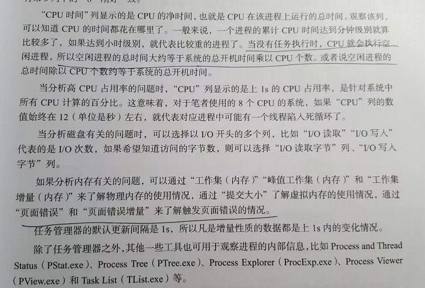

windows 操作系统核心架构。

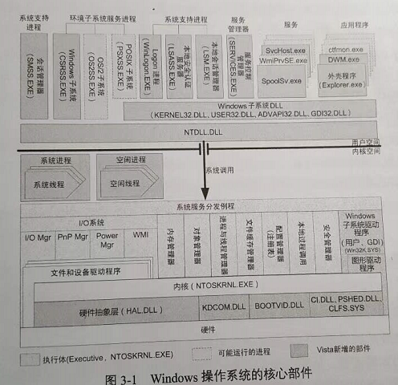

空闲进程详解。

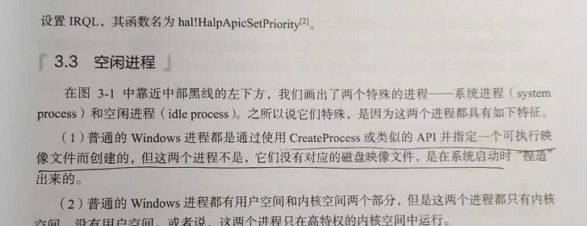

CPU 会空转。

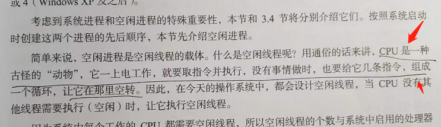

CPU 也有函数供操作系统调用。

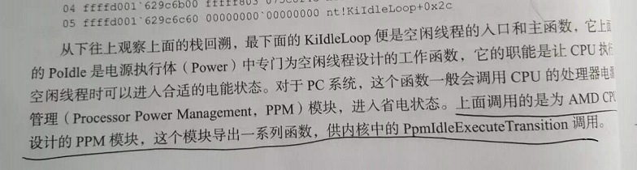

NTDLL.DLL 的作用。

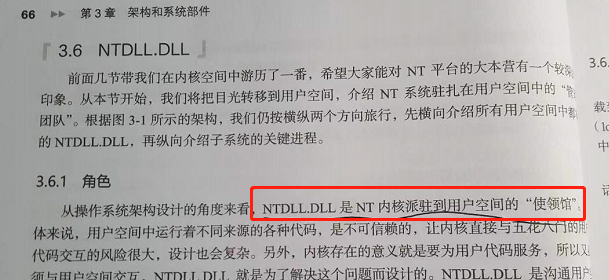

加载器。

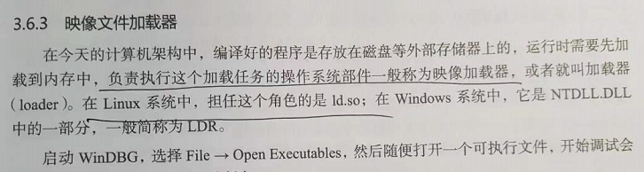

Windows 很重要的文件。

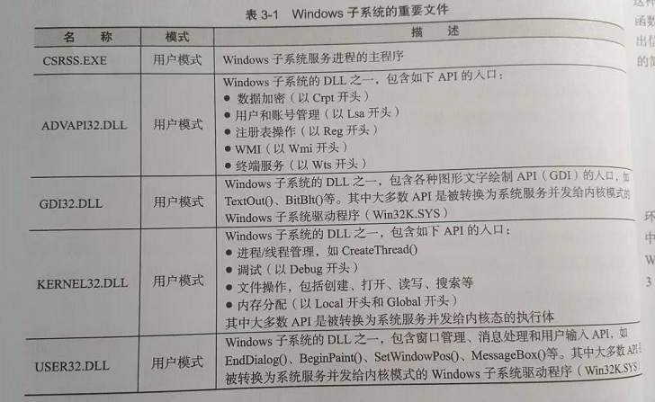

PE 格式的 Subsystem 字段。

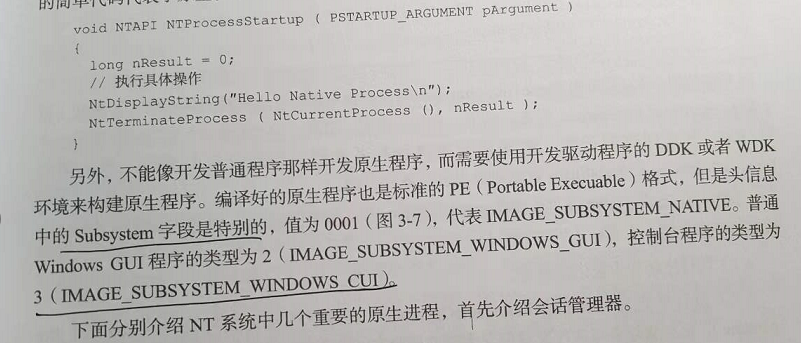

PEView 这个软件特别好用。

时钟中断。

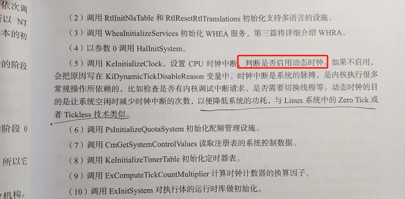

唤醒其他 CPU 。

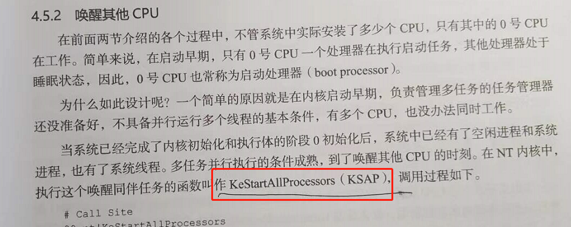

从线程的角度看 call。

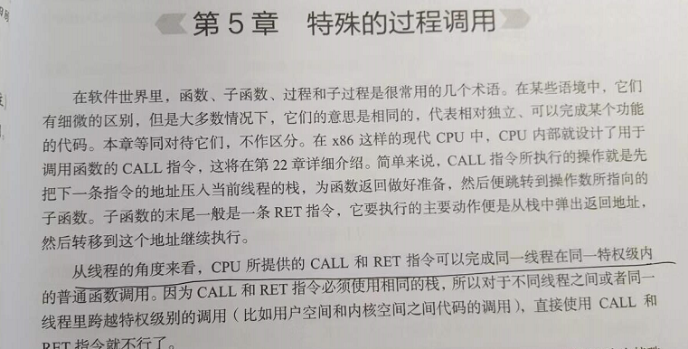

Windows 的二进制兼容传统。

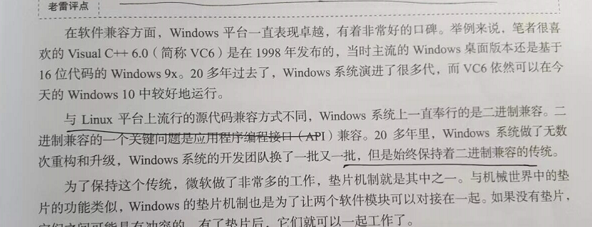

C++ 是静态语言，.net ，java 是动态语言。

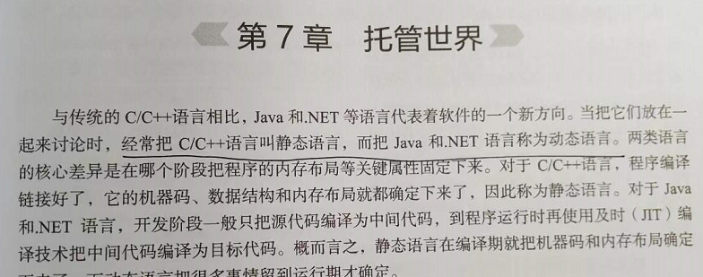

Windows 的Linux 子系统，居然不需要重新编译。

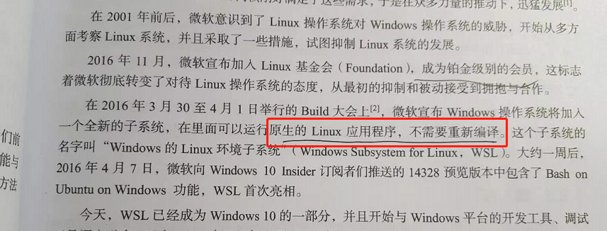

WSL 的服务进程。

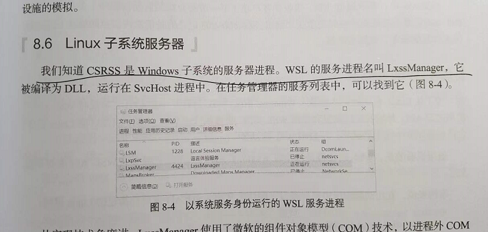

交叉开发。

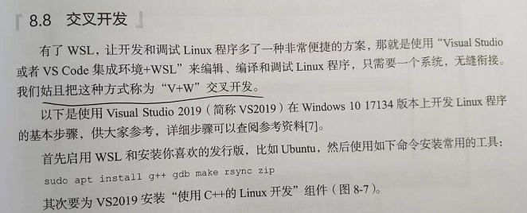

WSL 2 是误入歧途。

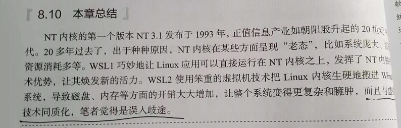
