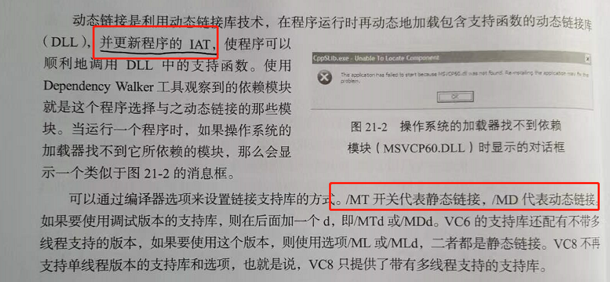
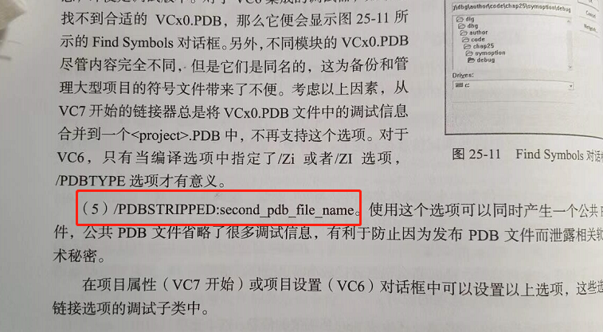

# 《软件调试卷二》学习笔记2

函数调用让 CPU 跳跃，中断跟异常赋予 CPU 飞跃的能力。

应用程序调试.。

内核调试方法。

WinDGB 本地内核调试。

调试器需要很多信息。

符号是黑夜中的灯塔。

注意 loader 的功能。

MSVC 的全称是 Microsoft Visual C++。 MS 是微软的缩写，V 是 Visual。

c1.dll 是编译器的前端。

运行时库其实就是语言生态的函数库。

MSVCP ，CP 是 C plus plus 的缩写。

运行时库可以静态编译的，这样会方便很多。

函数调用在汇编里面的情况。

x64 的优势是函数传参可以传 4个寄存器，性能会整体提高。

C++ this 对应的汇编。

缓存区溢出攻击。

try catch 的原理需要认真看。

PDB 文件格式是机微软密的。

公共跟 私有 PDB 格式。

PE 文档，Microsoft Portable Executable and Common Object File Format Specification

PDB 文件生成。

调试编译选项。

PDB 里面的源文件表。

