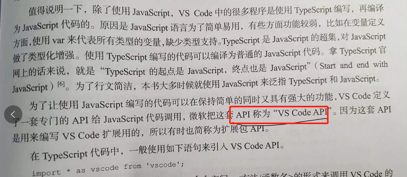

# 《软件调试卷二》学习笔记3

调试器也是有标准的。

可以直接在内存中搜索数据，这样很容易找到微信的聊天数据。

多核CPU里面原来有多套寄存器。

断点分类。

远程调试要认真看一下 第692页。

java 的调试器是 JDB。

调试器的架构。

VS IDE 一直是 32位的exe。

vs2019 没有源码新建数据断点的方法。

单步调试 UCRT 的代码。

vs2019 设置 pdb 文件路径。

vs2019 可以转存 进程信息，如下：

VSCODE API 

VsCode 也是用的 VsDebug。

GDB 调试模型。

新版的 windbg 架构。

windbg 目录相关工具。

调试器都可以直接搜索内存，以前 OD 的时候用过。

